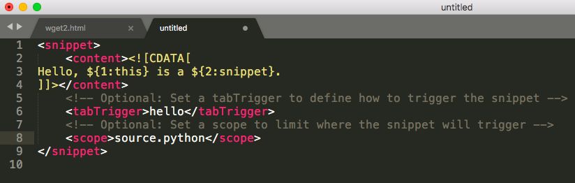

# Sublime 的 Snippets 快捷片段
> Sublime等编辑器等Snippets是个利器，输入自定义的一个词，按一下Tab，立刻调出来一大片段准备好的内容。尤其是HTML等Web编程，非常好用。

[官网说明链接。](http://sublimetext.info/docs/en/extensibility/snippets.html)
方法如下：
1. 打开Sublime菜单Tool -> New Snippets. 最新Mac版的，是在Tool -> Developer -> New Snippets.

2. 在弹出的XML格式文档中，找到<content>标签下的<![CDATA[...]]>标签中，把要生成的内容粘贴进来，比如一段HTML代码。
3. 解除下面的<tabTrigger>标签注释，在里面写一个`触发键`，越简单越好，比如hello。
4. [可选] 设置生效范围Scope。解除<scope>标签注释，填上目标文件种类的生效范围。这个不能随便写，需要对照[这个链接](https://gist.github.com/J2TeaM/a54bafb082f90c0f20c9)找到html, js等分别对应的scope码。或者更简单的是在目标文件里按`Ctrl+Alt+P`，就会弹出该文件的Scope码，把它填进<scope>标签即可。
5. 保存snippets文件到Sublime的User文件夹中，文件必须以`.sublime-snippet`结尾。而这个文件夹的位置，如果是Windows就直接在软件文件夹里找`User`文件夹即可，Mac的话在`/Users/用户名/Library/Application Support/Sublime Text 3/Packages/User/`这里。
6. 保存好以后，会及时生效，不用重启软件。
