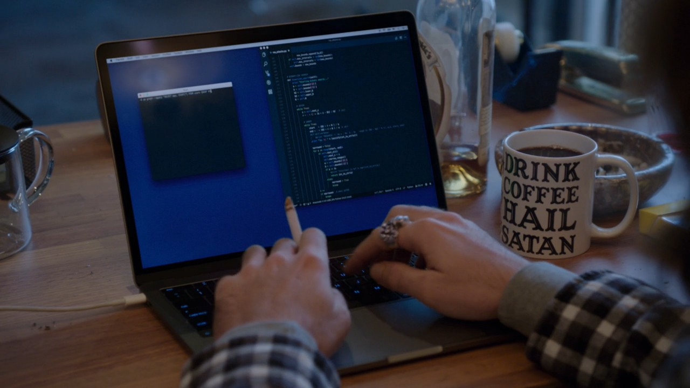
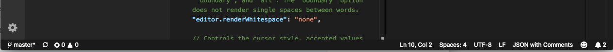
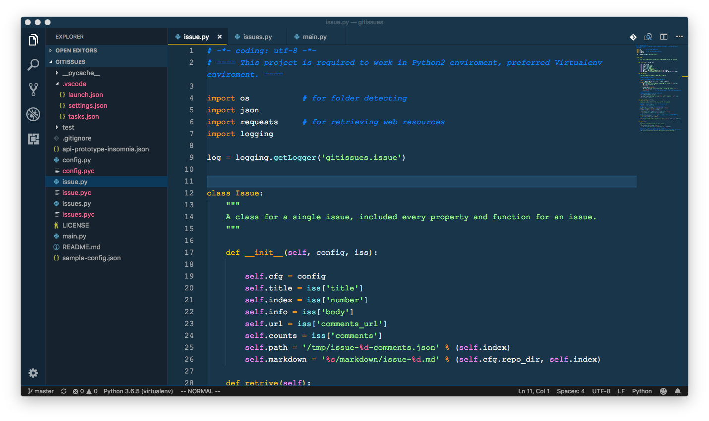

# VScode
> VS Code 叫 "Visual Studio Code"，但是完全不同于"Visual Studio"，可以不用害怕。实际上相当轻量、可定制、好看。被称为`The last editor you'll ever need`.

[参考Youtube：VS Code: The Last Editor You'll Ever Need](https://www.youtube.com/watch?v=anvYeA1pWlk)

安装极其简单，Mac上下载好文件后，直接双击运行就ok了。


硅谷第五季截图

## 更改下面状态栏status bar的颜色
vscode界面设计可以说相当出彩。唯一违和的地方就是状态栏的颜色。所以我第一件事就是查清楚怎么改它的颜色。

非常简单，只要修改用户配置文件即可。
Mac上，直接在IDE中`Ctrl+,`打开用户配置文件，在适当位置加入下面这段话：
```js
"workbench.colorCustomizations": {
    "statusBar.background" : "#1A1A1A",
    "statusBar.noFolderBackground" : "#212121",
    "statusBar.debuggingBackground": "#263238"
}
```
完成。


## 推荐颜色主题：

### `Cobalt2`


