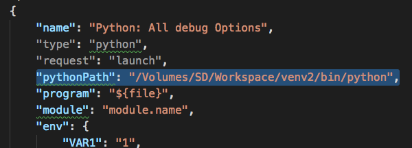

# VSCode为Python配置Debug调试(virtualenv环境)
因为python自身的版本原因，环境是个非常重要的因素。我们经常需要多种环境，所以必须要配置好才能在vscode里面进行调试和运行。

vscode会在每个项目文件夹下创建一个`.vscode`文件夹，保存当前项目的运行环境的配置文件。
主要有三个：
- `.vscode/launch.json`
- `.vscode/tasks.json`
- `.vscode/settings.json`

这两个文件可以自己手动创建，也可以在菜单里选择让软件来创建。

## `launch.json`
打开菜单：`Debug -> Open Configurations`，如果没有则选择创建，然后进入`launch.json`的编辑。
内容较多，搜索`pythonPath`，找到对应的变量，把内容改为你的python环境地址。如：



## `tasks.json`
打开菜单：`Tasks -> Configure tasks`，没有则选择创建一个，然后进入`tasks.json`的编辑。
```json
{
    "version": "2.0.0",
    "tasks": [
        {
            "label": "python",
            "type": "shell",
            "command": "输入你的python运行地址，本机或虚拟环境的都行：如.venv/bin/python",
            "args": [
                "${file}"
            ],
            "group": {
                "kind": "build",
                "isDefault": true
            },
            "problemMatcher": [
                "$eslint-compact"
            ]
        }
    ]
}
```

## `settings.json`
在软件左下角状态栏中有选择环境的按钮，选择以后，就会自动生成`.vscode/settings.json`。如果没有，自己创建一个也行。打开文件进入编辑：
找到`Workspace settings`一栏，修改如下变量：
```
"python.pythonPath": "输入你的python运行地址，本机或虚拟环境的都行：如.venv/bin/python"
```
