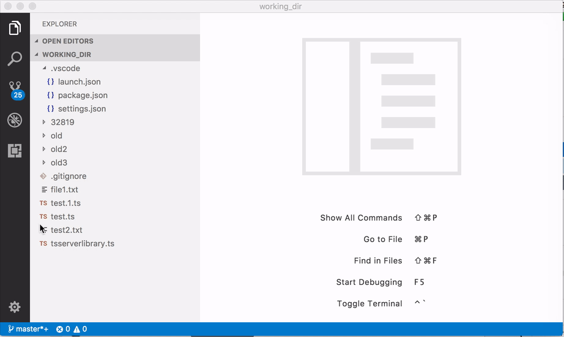

# VScode对比文件（同时滚动）
网上查了好多VScode让两个分屏同时滚动的方法。
结果找错了方向。
vscode原生带有文件对比功能，而且不是单纯的同时滚动。
而是`diff`命令的强化高亮显示，简直非常强大。

直接在文件树上右键`compare file`就好了。

参考：https://github.com/Microsoft/vscode/issues/34762#issuecomment-331200325

