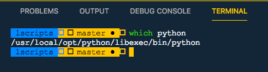
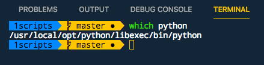

# Vscode终端Terminal无法显示zsh的字体问题

一般ZSH字体都很漂亮，不是`Meslo`就是`DroidSansMono`，但是vscode的终端显示不出来，如下：


参考：https://github.com/Microsoft/vscode/issues/15119#issuecomment-259248159

这点需要在vscode的用户设定里设置字体才可以。
打开用户设置，加上这两句话：
```json
# 指定终端的字体 (注意名字要完全符合font名）
"terminal.integrated.fontFamily": "Meslo LG M Regular for Powerline",

# 指定终端字大小
"terminal.integrated.fontSize": 14
```

设置完后点保存，terminal就自动变样了：




注意要检查你本地系统里有没有同名的字体，只有存在时才能正常显示。

根据众多vscode的issues，基本上都是通过这一个解决的。如果没有解决，只能是字体名字没写对或没有这个字体。
一定要先检查自己的Terminal设置里的字体是不是一样的。
