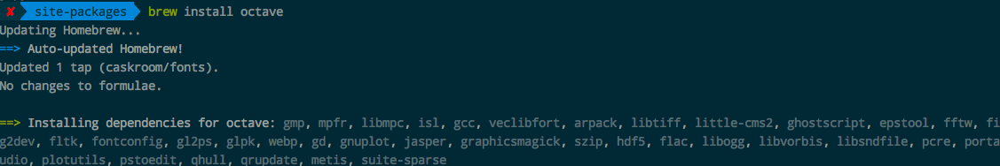
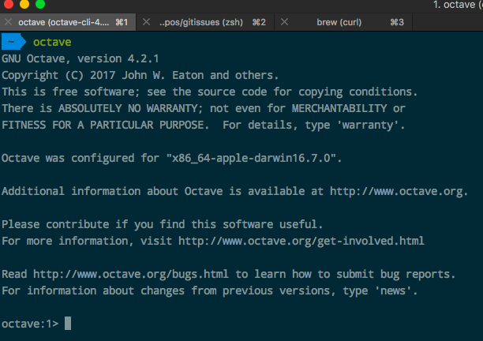
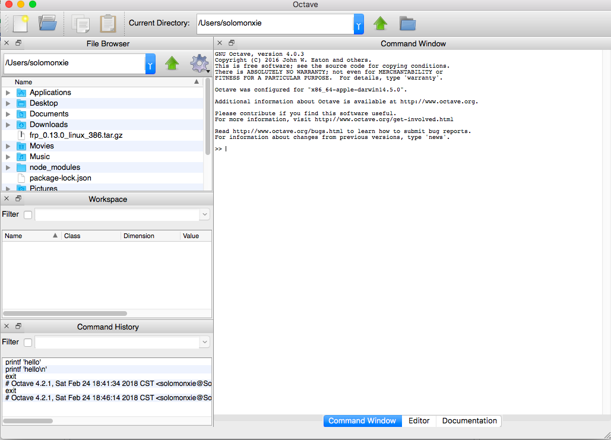
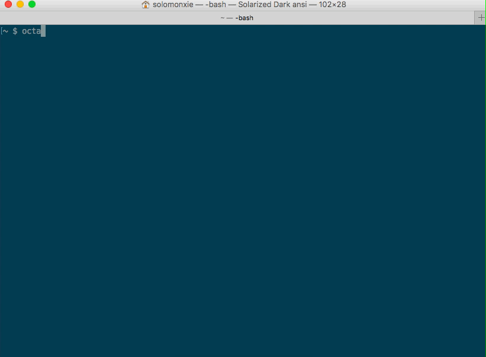

# ❖ Octave 入门

> Matlab实在太贵，所以Andrew Ng推荐的完全开源免费的Octave却是个好的替代物。

关于为什么要用Octave，而不是用别的Matlab代替品如Freemat, Spider等，[这篇AskUbuntu](https://askubuntu.com/questions/80164/comparison-of-octave-spyder-freemat-and-scilab-as-alternatives-to-matlab)里有非常详尽的解答。

简而言之：Octave是Matlab毫无疑问的最好代替品，语法相似性达95%以上，功能完善，且社区、文档非常详尽。反之其它代替品，则要不就语法相似度低、要不就功能不全、要不就几乎没有文档学习参考。

## Octave 安装 （命令行中运行）

安装GNU官网的说明，[参考自己的平台安装方式](https://www.gnu.org/software/octave/download.html)。Mac上直接`brew install octave`即可。

可以看到，octave需要非常多的依赖包。我装了大概一个多小时吧。完成后，就可以通过命令行输入`octave`直接进入了：



## Octave 安装 （包括GUI界面）

参考[官网页面](https://wiki.octave.org/Octave_for_macOS)。
Mac版的[GUI版Ocatave下载地址](https://sourceforge.net/projects/octave/files/Octave%20MacOSX%20Binary/2016-07-11-binary-octave-4.0.3/octave_gui_403_appleblas.dmg/download)，下载好后是大概300M的dmg文件。
然后打开后，完成初始提示，就可以看到主页面了：



## Octave 安装（Jupyter notebook)

在本机已安装Octave、Jupyter的情况下，进入Jupyter notebook的运行环境（系统或虚拟环境），输入这些命令安装：
```sh
pip install metakernel
pip install octave_kernel
python -m octave_kernel install
echo export OCTAVE_EXECUTABLE=$(which octave) >> ~/.zshrc
```
然后重启Jupyter就可以看到多了一个Octave kernel了。


## Octave绘图

命令行中的Octave也是能绘图的，只要用`plot(...)`函数就行。它会弹出一个小窗口，显示图形。效果如下：



## 关于Mac上Octave GUI客户端运行缓慢问题

需要注意的一点是，Mac上的Octave极其缓慢，程序经常自动停止运转，一个一根线的绘图更是要等很久。所以没有耐心的又想用Octave的，还是在命令行里用吧。
