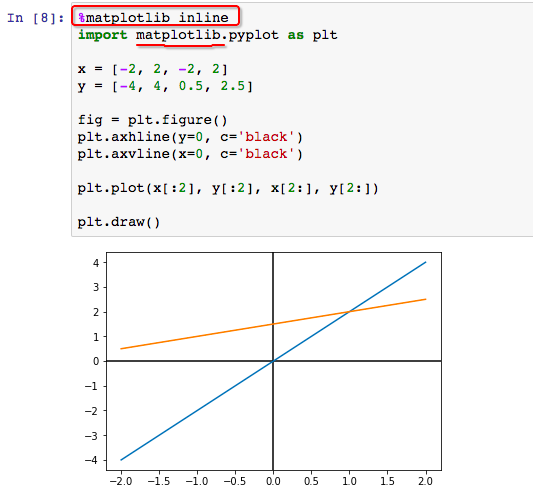

# Jupyter Notebook 绘图
> 苦于Matlab实在太贵， Octave又不能做笔记展示，所以考虑Jupyter用来做简单绘图，来辅助学习线性代数。

Jupyter 的魔法命令里有一个`%matplotlib inline`，可以直接在jupyter里面绘制出静态图形。但是需要先安装`mataplotlib`的package，简单一句`pip install matplotlib`搞定。
注意：最好还是在virtualenv里安装调试，这样也不需要`sudo pip install`也不会搞乱系统。
参考[这篇机器学习的jupyter笔记](http://nbviewer.jupyter.org/github/zlotus/notes-linear-algebra/blob/master/ReadMe.ipynb?flush_cache=true)，直接复制了某一段出图的代码，在jupyter里运行，哒哒！出图了！

（在virtualenv里面安装各种包实在是太爽了，完全没障碍，不需要任何配置，不需要重启jupyter，完美运行）

#### 注意：Jupyter出的是静态图，如果用Matplotlib绘制动态图（动画）就不能用Jupyter了。
