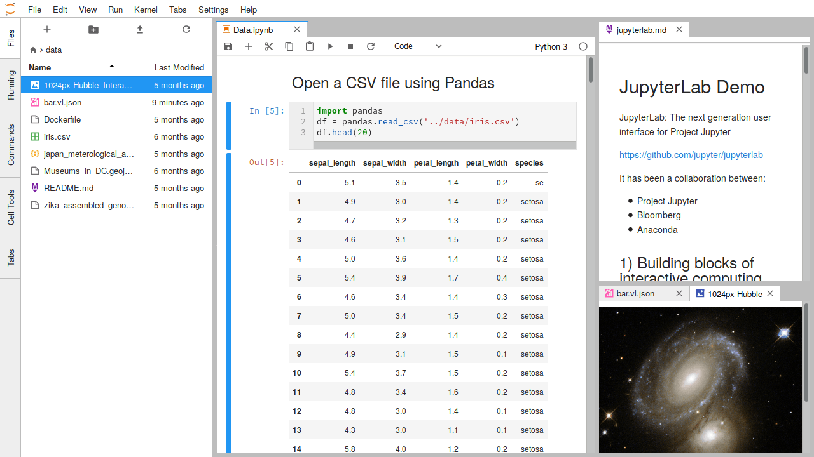
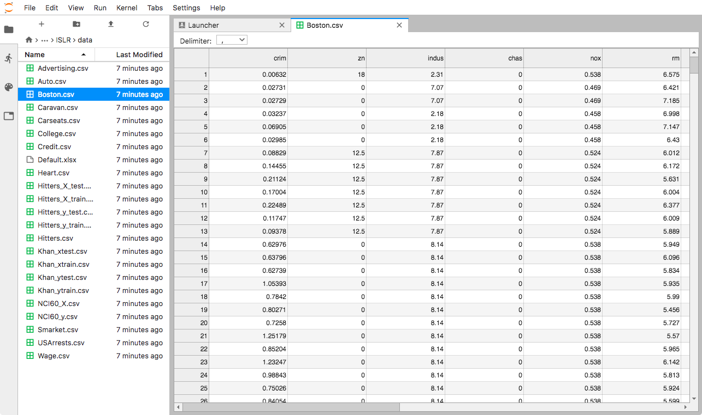
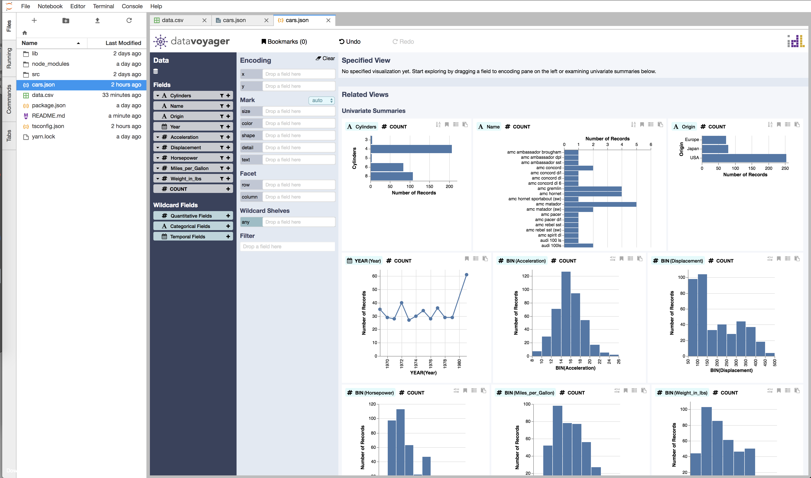

# ❖ 「JupyterLab」 Jupyter Notebook 新生代IDE模式页面

[参考：Overview](https://jupyterlab.readthedocs.io/en/stable/getting_started/overview.html)



安装：
```sh
$ pip install jupyterlab
```

启动（不是jupyter notebook）：
```sh
$ jupyter lab
```

> Jupyterlab中最好用的就是显示csv数据。

CSV数据显示效果：




## 安装插件
> `jupyterlab`是和`jupyter notebook`隔离的，也就是`notebook`中的插件在这里不能用。

Jupyterlab的插件都是基于NodeJS安装的，但同时所有npm的包也会自动保存到当前的python环境中（或虚拟环境）。


安装命令格式是：
```sh
# 安装NPM包
$ jupyter labextension install <NAME>
```

常用插件安装：
```sh
# 目录结构显示
jupyter labextension install @jupyterlab/toc

# Voyager 数据优化浏览
jupyter labextension install jupyterlab_voyager

# Drawio 画流程图
jupyter labextension install jupyterlab-drawio

# Lantern数据绘图加强
jupyter labextension install pylantern
jupyter serverextension enable --py lantern


```

优选插件效果如下：

jupyterlab_voyager:


