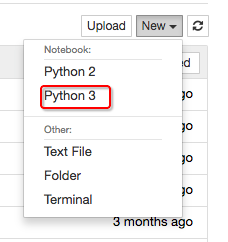

# ❖ 为什么要用IPython/Jupyter? 

> python里面调试确实有点烦恼，尤其是在vim里，想要尝试一些简单的编码问题，实在是有点麻烦，不想到命令行模式一行一行执行，也不想再新建一个文件测试一个简单的功能。

而且就是不管这些，测试一个简单的功能如学习语法、测试编码、测试新学习的包等，在IDE里面测试，看不到每个部分的output效果（除非自己手动去命令行里复制或截屏），在命令行里测试，则没法轻松撤销前面的代码。。。。
所以这时候才想到好像前阵子看到youtube视频里别人用IPython，是那种又能轻松编辑又能为每部分显示output效果，还能在旁做markdown笔记的东西。
出于这个想法，搜到了这篇[知乎回答](https://www.zhihu.com/question/51467397)，看到了不少有意思的东西，感觉又展开了一个崭新的领域，python的视界豁然开朗。
[这篇文章](https://zhuanlan.zhihu.com/p/33654849)极好的解释了IPython的入门用法，相当酷！我怎么竟然这么久都不知道这种东西的存在？

### IPython和Jupyter的区别？
据说一开始IPython是作为`IPython shell`的存在，后来Jupyter融合了它，又把自己和IPython上独立出来，做成了网页版的`Jupyter Notebook`这样的东西。Jupyter强大的特性，加上和各种数据研究库的紧密结合，真让人不能忽视它的存在了。
IPython的安装方法，简单地`pip install ipython`即可。
但是，想到IPython本身一个shell，让我想起了我自己用的shell是`zsh`，让我把zsh切换到别的shell里面去，还真有点不喜欢。。这可能是个stylish issue吧。
所以，应该直接了当的安装jupyter，其中也会自动安装上`IPython shell`，作为其运行的Kernel。

## 错误的安装Jupyter
~只安装Jupyter本身的话，很简单：`python -m pip install jupyter`。不过根据官方文档，强烈建议安装Jupyter的`Anaconda`发行版，像大礼包一样的自动安装`python+Jupyter Notebook+一系列数据研究库`。因为本来就是要研究机器学习等一系列数据研究的，所以Anaconda正合适。这个我觉得再好不过了，所以直接跳到[`Anaconda`页面](https://www.anaconda.com/download)去看安装方法。然后看到，Anaconda安装方法是不能简单`apt-get`或`brew`或`pip install`的，500M左右的大小，需要下载后启动图形安装工具或shell脚本安装（`.sh`文件本身就500M，而且安装分为Python 3和Python 2的两种方式。~

然后就会发现：**Anaconda谁装谁后悔！**
Anaconda体积庞大，软件管理看起来一体化简单，实际上在处理一些Bug和自定义设置的情况下非常不好定位。我在Mac上初次安装Anaconda大礼包后，连简单的`jupyter notebooke`这样的命令都执行不了，详尽了办法最后才用直接指定路径的方式运行。这只是一开始，之后还有notebook里各种找不到外部安装的python package的情况。
所以还是别图便宜，手动安装一步一步来吧。一键安装很多时候都没那么好。
试了下手动安装的方法，`pip install jupyter`，或者官方的`python -m pip install jupyter`，都会发生`jupyter: command not found`找不到命令。参考了数十篇网络上中英文文章，都没有解决。常说的直接引用`~/.local/bin`这个位置的 jupyter也不行（没有）。
终于，意识到这些方法都是错误的思路。

## 正确的安装Jupyter Notebook
不管官网怎么推荐Anaconda，网络上各种简单解说，总之Anaconda或`pip install jupyter`都很容易引发巨大的问题。由于jupyter的性质：它是调用python内核的东西，用系统python还是用自己的python，这都是很敏感很麻烦的问题。用系统的python很容易识别不到或者被别的程序修改导致bug，用自己的python会导致别的地方安装的package在jupyter里识别不了。
所以：
参考了[这篇的思路](https://zhuanlan.zhihu.com/p/27542582)，正确的方法是在virtualenv虚拟环境下，绝对安全封闭的环境下用`pip`安装jupyter。这样的话，第一，不需要`sudo pip`这样敏感的东西去安装jupyter这么复杂的工具；第二，也保证了jupyter不会搞乱其它东西。
然后，二话不说，在已有virtualenv的情况下，在某个文件夹里建立虚拟环境，并启动虚拟环境。然后简单一句`pip install jupyter`，完成安装。
安装完成后`jupyter notebook`，完美运行！
```shell
# for Python2
$ pip install jupyter

# for Python3
$ pip3 install jupyter
```
这样的话，即使以后要在jupyter里各种安装插件、各种配置新kernel等，都不用害怕了，因为再怎么玩弄，也出不去这个圈。
话说回来，实际上你也没什么需要在全系统配置jupyter的必要，在某个文件夹玩就足够足够的了。
何必呢？

## 启动Jupyter
用命令行启动很简单，在某个工作目录，输入：
```
$ jupyter notebook
```
这样就能以这个目录打开一个`http://localhost:8889/tree`的网页，一切都在这个网页里操作。

## 正确的启动Jupyter
正确的方式，实际上是在Virtualenv虚拟环境下启动，可以随意安装各种包，适配各种Python版本环境：
```shell
# 启动Virtualenv
$ source ~/PATH-TO-VENV/activate 

# 启动Jupyter
(venv)$ jupyter notebook
```

## 添加Python3 Kernel
[参考：Jupyter增加内核](http://www.cnblogs.com/Jeffiy/p/4861528.html)

默认的只有Python2 Kernel，所以只能建立Python2的笔记。
要添加也很简单。
**强烈建议在Python3的Virtualenv虚拟环境下实现！！！**
```shell
# 启动Virtualenv
$ source ~/PATH-TO-VENV/activate 

# 在Python3的虚拟环境下安装Kernel
(venv3)$ pip3 install ipykernel

# 将Kernel添加进Jupyter笔记选项中
(venv3)$ python -m ipykernel install
```
启动Jupyter notebook后，就会看到Kernel里面多了Python3了：


### 终端里找不到`jupyter`命令
总是报`command not found jupyter`错误，说没有这个命令。一开始还以为是zsh的问题，可是切换到bash也一样。
照着网上攻略在`.zshrc`里改也没用，在`.bash_profile`里改也没用。
然后发现，在Mac自带的Terminal.app中就可以正常打开，不需要改任何配置。
这才知道原来是iTerm2无法识别。于是在Terminal.app中用`which`命令查看jupyter命令的所在处，看到它位于`/Users/我的用户名/anaconda2/bin/jupyter`这个地方。
于是直接在`~/.zshrc`中加入alias：
```shell
$ alias jupyter="/Users/我的用户名/anaconda2/bin/jupyter"
```
重启iTerm2，好用！

但是，iTerm2中的bash还是不能访问，用同样的方法也不行。暂时没找到解决方法。


## 常见问题

### Kernel Error
这个一般是你的`.ipynb`文件中的kernel指定问题。
比如你创建笔记文件时，指定的是Python2的环境（或虚拟环境），然后你本机的Python2环境或虚拟环境被删除了，然后Jupyter根据笔记文件里指定的路径地址，就找不到Kernel了。
所以打开笔记本的这个笔记 -> 点菜单上Kernel -> 点Change Kernel -> 选一个当前环境支持的Kernel就可以了。

