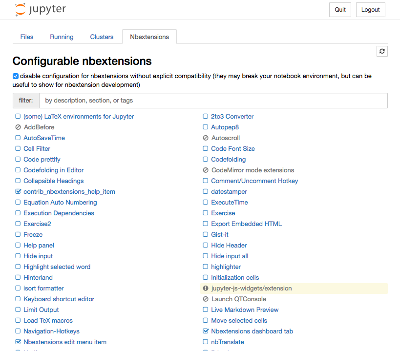
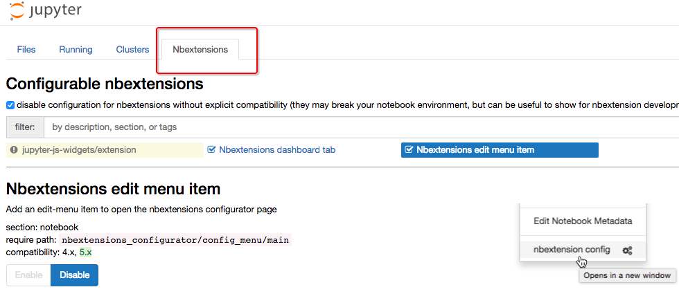

# ❖ Jupyter Notebook 安装插件

> 强烈建议在Virtualenv虚拟环境下使用pip安装，这样就不需要什么`sudo`或`--user`之类的了，也不会搞乱系统级的配置。

一键安装所有东西：
```sh
# 安装插件配置器
pip install jupyter_nbextensions_configurator
jupyter nbextensions_configurator enable

# 安装所有插件包
pip install jupyter_contrib_nbextensions
jupyter contrib nbextension install

# 安装所有主题
pip install jupyterthemes
```




## 1. 安装插件管理器 Jupyter Nbextensions Configurator
[Refer to Github page.](https://github.com/Jupyter-contrib/jupyter_nbextensions_configurator)

```shell
# 安装Jupyter的配置器
$ pip install jupyter_nbextensions_configurator

# 启动配置器
$ jupyter nbextensions_configurator enable --user
```
装好后，输入`jupyter notebook`命令打开网页，就会发现多出一个栏目：


## 2. 安装插件包 Jupyter-extensions

```sh
# 下载所有插件包
pip install jupyter_contrib_nbextensions
# 安装下载的插件包
jupyter contrib nbextension install
```

## 3. 安装颜色主题 Jupyter-themes
[参考：Github jupyter-themes](https://github.com/dunovank/jupyter-themes)

安装：
```sh
$ pip install jupyterthemes
$ pip install --upgrade jupyterthemes
```

使用方法：
`Jupyter-themes`实际上是一个命令行的命令工具，切换主题的话需要用命令行来执行。安装好后，就可以用`jt`命令来执行。

以下是常用的命令：
```sh
# 查看所有颜色主题 --list
$ jt -l

# 选择主题 --theme
$ jt -t 主题名称

# 恢复默认主题 --recover
$ jt -r
```


## 4. 使用Sublime Text快捷键
> Jupyter固然好用，但是直接在里面写代码真的很烦，效率还没有直接在记事本里面高。
所以非常有必要设定为Sublime Text的快捷键，加速编程效率。

[参考：把Jupyter Notebook配置成Coding神器（Windows）](http://resuly.me/2017/11/03/jupyter-config-for-windows/)
[参考：在 Notebook 中使用 Sublime Text 快捷键](http://codingpy.com/article/sublime-text-style-keymap-in-jupyter-notebook/)

主要方法就是新建（或修改）`~/.jupyter/custom/custom.js`文件，加入这么一段运行命令：
```js
require(["codemirror/keymap/sublime", "notebook/js/cell", "base/js/namespace"],
    function(sublime_keymap, cell, IPython) {
        // setTimeout(function(){ // uncomment line to fake race-condition
        cell.Cell.options_default.cm_config.keyMap = 'sublime';
        var cells = IPython.notebook.get_cells();
        for(var cl=0; cl< cells.length ; cl++){
            cells[cl].code_mirror.setOption('keyMap', 'sublime');
        }

        // }, 1000)// uncomment  line to fake race condition
    }
);
```

保存退出然后刷新Jupyter页面即可。

亲测即使是在Virtualenv虚拟环境中运行的Jupyter，也会识别同样的这个文件。

如果本地的`custom.js`不在那个位置，那么就需要在Jupyter里面运行一段代码来检查位置在哪里了：
```py
# 打印 Jupyter  配置目录的路径
from jupyter_core.paths import jupyter_config_dir
jupyter_dir = jupyter_config_dir()
print(jupyter_dir)

# 打印 custom.js 的路径
import os.path
custom_js_path = os.path.join(jupyter_dir, 'custom', 'custom.js')
print(custom_js_path)

# 如果 custom.js 文件存在，打印其内容
if os.path.isfile(custom_js_path):
    with open(custom_js_path) as f:
        print(f.read())
else:
    print("You don't have a custom.js file")
```

完成后，快捷键如下：
```
Ctrl+ L 选择一行(连续选取多行)    
Ctrl+ D 选择当前变量(或重复选择并编辑)    
Ctrl+ Shift+ M  选择括号里面的内容   
Ctrl+ Shift+ K 
或 Ctrl+ X   删除一行    
Ctrl+ K K   删除本行光标后的所有内容    
Ctrl+ Shift+ D  快速复制一行  
Ctrl+ K U   大写  
Ctrl+ K L   小写  
Ctrl+ / 注释  
Ctrl+ Tab   代码提示,可以连续多按
```
