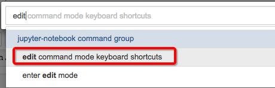
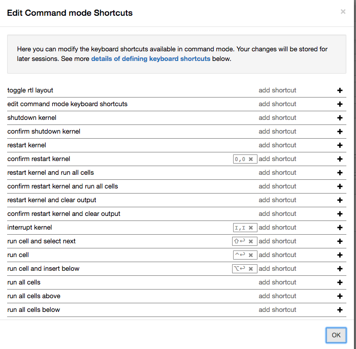

# Jupyter Notebook 修改快捷键


## 方法一：在网页里直接设置

直接在帮助菜单里找到`edit command mode keyboard shortcuts`：



然后修改对应的快捷键：




## 方法二：修改自定义脚本.js文件

[参考官方文档：Keyboard Shortcut Customization](https://jupyter-notebook.readthedocs.io/en/stable/examples/Notebook/Custom%20Keyboard%20Shortcuts.html)

在用户目录下会有一个`.jupyter`目录，里面留有用户自定义的js和css文件，可以实现自定义修改，像vimrc和zshrc一样。

文件位置：`~/.jupyter/custom/custom.js`

修改方法：
在`custom.js`中加入以下javascript语句添加快捷键：
```js
Jupyter.keyboard_manager.command_shortcuts.add_shortcut('r', {
    help : 'run cell',
    help_index : 'zz',
    handler : function (event) {
        IPython.notebook.execute_cell();
        return false;
    }}
);
```

