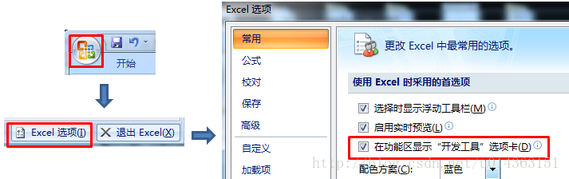
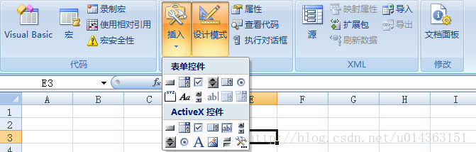

# Excel VBA/VBS 脚本入门 [DRAFT]

> 把它Excel放在IDE专题里是觉得，Excel的VBA开发环境也是一个工具，而且几乎就是Visual Studio。

日常工作里技术、非技术岗位都会遇到这类Excel自动化需求。所以这里总结一下常用的脚本写法。


## 开启Excel的开发者模式




## 脚本触发点

触发点有很多，目前比较常用的：
- 点击按钮触发（最简单）
- 打开Excel表就触发
- 某个Cell格变动就触发


### 点击按钮触发脚本

[参考：Excel创建按钮调用宏](https://blog.csdn.net/fullstack/article/details/28393903)

在`开发工具`栏中，点击插入，选择“按钮”：




## 基础语法

函数：
```vbs
Sub 函数名()
    ' DO SOMETHING
End Sub
```

字符串连接：
```vbs
username = "Jason"
s = "My name is " & username
```

注释：
```vbs
' 这句是注释
Rem 这个关键字后面的也算为注释
```
VBS里没有多行注释，只有单行。


## 遍历文件夹内所有文件

[参考：Excel VBA - 遍历某个文件夹中文件、文件夹及批量建立txt](https://blog.csdn.net/alexbnlee/article/details/6932339)

VBS遍历文件，主要用的是`Dir()`函数。

`Dir`主要原理是类似`Generator`生成器一样的东西：你初始化的时候给它一个文件名称规则，它就搜索所有符合这个规则的文件，然后不是一次性返回这个列表，而是每次调用`Dir`时候给你返回一条。

`Dir`的用法是：
```vbs
' 初始化Dir生成器
gen = Dir("C:\Users\Jason\Desktop\" & "*.xlsx")

' 再次调用Dir，得到列表中第一个文件，第二次不用填参数即可使用
FirstFile = Dir

' 第三次调用，获得列表中第二个文件
SecondFile = Dir

' ...
```

当然，一般是用While loop来遍历这个生成器的：
```vbs
gen = Dir("C:\Users\Jason\Desktop\" & "*.xlsx")

Do while OneFile <> ""
    OneFile = Dir  '获取文件列表中的一个元素
    MsgBox OneFile
Loop
```


下面是案例：
```vbs
' 先获取指定文件夹下所有*.xlsx文件列表
FileList = Dir("C:\Users\McDelfino\Desktop\2.JPL_SCAT_EXCEL全\" & "*.xlsx")

count = count + 1       '记录文件的个数
s = s & count & "、" & FileList
Do While FileList <> ""
    FileList = Dir        '第二次读入的时候不用写参数
    If FileList = "" Then
        Exit Do         '当MyFile为空的时候就说明已经遍历完了，这时退出Do，否则还要运行一遍
    End If
    count = count + 1
    If count Mod 2 <> 1 Then
        s = s & vbTab & count & "、" & FileList
    Else
        s = s & vbCrLf & count & "、" & FileList
    End If
Loop
```


## 遍历某Excel中的Sheets工作簿

```vbs
For Each sh In Worksheets
    MsgBox sh.Name
Next
```


## 正则表达式


[参考：vba正则表达式入门](http://yshblog.com/blog/94)
