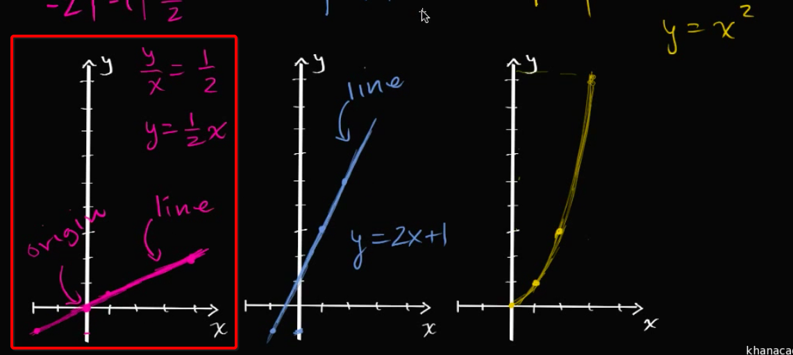
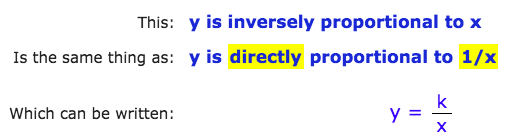

# Proportional relationship

Linearly, if x and y has a relationship that one is another's proportion, then they have a `proportional relationship`. Expression as:
`y/x = k.`

Or it's a version of linear equation `y=mx +b`, only the b=0, then `y=mx`.

> A relationship is proportional if its graph is a straight line through the origin. Remember that the origin is the point `(0,0)`

At the showing image above, only first one shows a proportional relationship. The other two are not linear and going through origin.

## Directly Proportional & Inversely Proportional

[Refer to Maths is fun.](https://www.mathsisfun.com/algebra/directly-inversely-proportional.html)

- `Directly proportional`: As one amount **increases**, another amount **increases** at the same rate.

- `Inversely Proportional`: when one value **decreases** at the same rate that the other **increases**.

