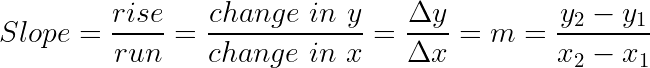
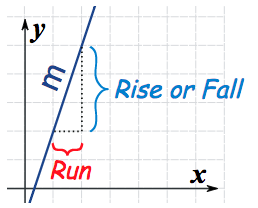
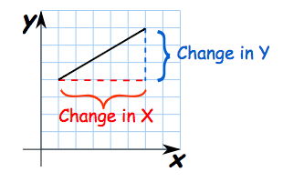
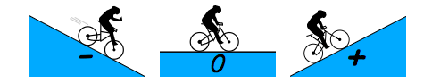
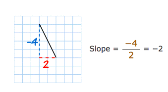

# The Slope of a line

[Refer to math is fun: slope](http://www.mathsisfun.com/geometry/slope.html)

- `Rise`: the vertical change is called "rise".
- `Run`: the horizontal change is called "run".

- `Positive slope`: the line is **going up**.
- `Negative slope`: the line is **going down**.
- `Slope of zero`: a horizontal line.
- `Undefined slope`: a vertical line.

## Slope-intercept form
`y = mx +b` is called "slope-intercept form` of an equation.
- m is the slope of this line
- b is the `y-intercept` of this line.
