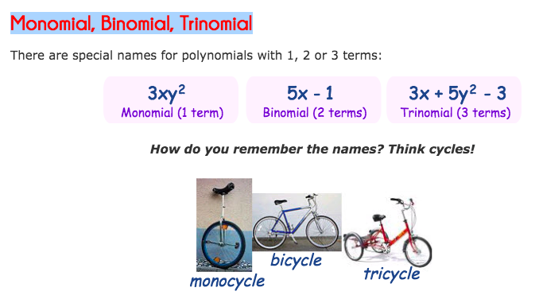

# Polynomials

[Refer to math is fun: Polynomials](https://www.mathsisfun.com/algebra/polynomials.html)

Just an expression of some values, including variables, exponents, constants...
It only fits to "poly" "nomials", aka. multiple terms, as below:

## `Degrees` of a polynomial
> Means the highest `exponent` of a variable in the polynomial.

For example, if it's a `quadratic`, then it's a `2nd degree polynomial`.

## `Monomial`, `Binomial`, `Trinomial`

## Multiply binomials

[Refer to math is fun: special-binomial-products](http://www.mathsisfun.com/algebra/special-binomial-products.html)

