# Parabola

[Refer to math is fun: Parabola](http://www.mathsisfun.com/geometry/parabola.html) : The graph for quadratic

> `Parabola` is a `quadratic`'s  graph.

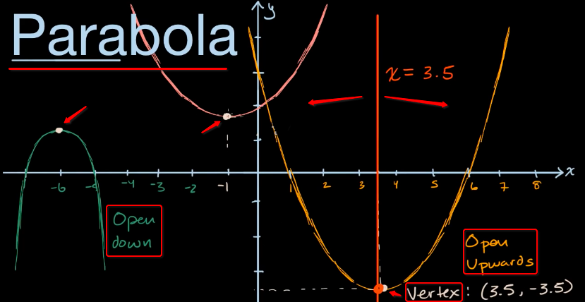

A `parabola` always has a `vertex`, either its `top point` or `bottom point`.
If you draw a **vertical line** goes through the `vertex`, it can divided the graph into `two mirrored part`.

## The `Concavity` of parabola
- When it opens up, we also call it `Concave up`,
- When it opens down, we also call it `Concave down`.


## Equation forms of a Parabola

[Refer to math warehouse: Equation forms of a Parabola](http://www.mathwarehouse.com/geometry/parabola/standard-and-vertex-form.php)

There're two common forms of equation to express the parabola:
`Standard form` and `Vertex form`.

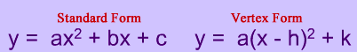

And there's another form for the parabola: 
the `Factor form`.

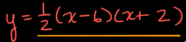


## How to get the Axis of symmetry

[Refer to math warehouse: How to get the Axis of symmetry](http://www.mathwarehouse.com/geometry/parabola/axis-of-symmetry.php)

> For a parabola, the `Axis of symmetry` goes through the `vertex`, which represent the `x position` of the `vertex`.

The `formula equation` of Axis of symmetry:
- In the `Vertex form` of quadratic `y = (x-h)² + k`, the symmetry line is: **`x = h`**. 
Mind that, to understand this form, refers to the `Absolute value graph` notion.


- In the `Standard form` of quadratic `y=ax²+bx+c`, the symmetry line is: **`x=−b/2a`**
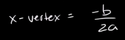

- In the `Factor form` of quadratic `y=c(x-a)(x-b)`, the symmetry line is: **`x=(a+b)/2`**
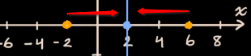

## How to get the `Vertex`
Getting the `Axis of symmetry` is half way to get the `vertex`, since it can only represent the `x position` of vertex. 
For getting the `y position`, just input the `x value` into the equation, and get the `y value`.
Solved.

It's easier to get the vertex in the `factor form` of quadratic:

Then the `vertex` is `(h, k)`.

## How to graph the quadratic
To graph a quadratic, we have a few different ways, and each needs the information of a few points:
- A `vertex` point, two `root` points.
- A `vertex` point, a `y-intersect` point.
- A `vertex` point, any two points on the graph.

[Refer this page to review how to get a parabola's intersects.](http://www.mathwarehouse.com/geometry/parabola/parabola-intercepts.php)

- To get two `roots`:
Just solve the equation and get two solutons (if there're two solutions).

- To get the `y-intersect` point:
Simply let the `x=0`, 
and solve the quadratic to get `y` position of the vertex.
And input the `y` value to the equation, to solve `x` position. Then we get the vertex:
`(x, y)`

- To get `any two points` of the graph:
Just ASSUME two `x positions`,
then input to the quadratic, to get `y positions`. Then we get:
`(x1, y1)` and `(x2, y2)`


## `Parabola` from geometric perspective

[Refer to khan academy: `Parabola` from geometric perspective](https://www.khanacademy.org/math/algebra2/intro-to-conics-alg2/focus-and-directrix-of-a-parabola-alg2/a/parabola-focus-directrix-review)
> Definition: A parabola is the set of **ALL POINTS** whose **distance** from **a certain POINT** (the `focus`) is equal to their distance from **a certain LINE** (the `directrix`).

It means, 
> To draw a parabola, you only need `a point` and `a line`.
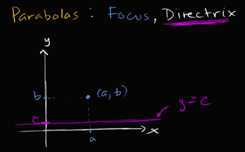

[Khan lecture.](https://www.khanacademy.org/math/algebra2/intro-to-conics-alg2/focus-and-directrix-of-a-parabola-alg2/v/focus-and-directrix-introduction)
[Maths if fun.](http://www.mathsisfun.com/geometry/parabola.html)

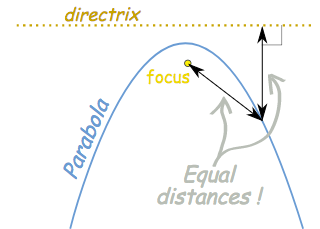

### Equation for the parabola

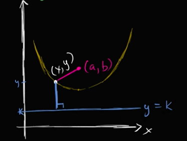

In this graph above, we will get an equation by `Pythagorean Theorem`

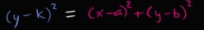

And expand that equation, we got a parabola equation in `Vertex quadratic form`:

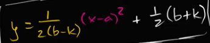

```py
y = c (x - i)² + j
```
So we could spot out the `focus` and `directrix` information from a vertex quadratic equation.
In which, the `(i, j)` represent the `vertex`, `(h, k)` represents the `focus`, and the `y=k` represents the `directrix`.


## Equation of a parabola from focus & directrix

[Khan practice.](Equation of a parabola from focus & directrix)

### Example
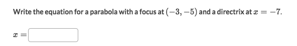
Solve:
According to the `focus` and `directrix` information, we know we can consist an equation like:
```py
(y-k)² = (x-a)² + (y-b)²
```
But that's for a `vertical parabola`. When the `directrix` is obviously making it to a `horizontal parabola`, we have to change the equation to:
```py
(x-k)² = (x-a)² + (y-b)²
```
So it becomes:
```py
(x+7)² = (x+3)² + (y+5)²
```
Expand the equation to get:
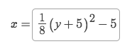

