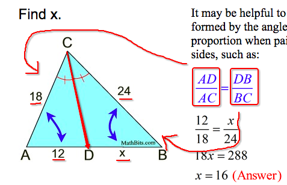
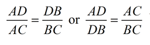

# Bisect

You can bisect a line segment, an angle, a shape, etc.

Bisector is the point or line or anything you use to divide things.
An `angle bisector` is a line, or you could say you draw a line bisects the angle.

[Refer to math is fun: `Bisect`](http://www.mathsisfun.com/geometry/bisect.html)
`Bisect` is a verb, means to divide into two equal parts.

## Angle Bisector Theorem

[Refer to math bits notebook: `Angle Bisector Theorem`](https://mathbitsnotebook.com/Geometry/Similarity/SMAngle.html)
When we draw an `angle bisector` in a triangle, we get two equal ratio of related lines.

It could be also two ratios like this:

