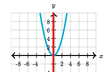
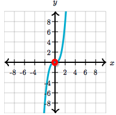

# Even & odd functions

[Refer to khan academy: Even & odd functions](https://www.khanacademy.org/math/algebra2/polynomial-functions/symmetry-of-polynomial-functions/a/symmetry-of-polynomials)

It's about the `symmetry` of a function.
And the `line of symmetry` **HAS TO BE** either `y-axis` or the `origin`.

- If the function's graph is symmetry about the **`y-axis`**, we call it an **`Even Function`**,
and `f( -x ) = f( x )`.
- If the function's graph is symmetry about the **`origin`**, we call it an **`Odd Function`**,
and `f( -x ) = - f( x )`.

`Even function`:

`Odd function`:

