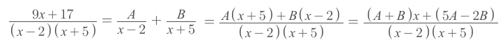
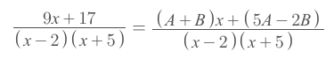
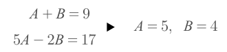
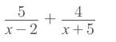

# Partial Fractions
> It's a very useful trick even for Calculus problems

[`▶ Jump forward to the note on application on Partial fractions for Calculus Integration.`](https://github.com/solomonxie/solomonxie.github.io/issues/49#issuecomment-395949004)

### Example

Solve:
- Factorize the dominator.
- Write `Partial fractions` according to the **dominator**.
- Add up the partial fractions and arrange it in the same form of **nominator**:

- Compare the **nominators** of both fraction:

- Build `System of equations` to solve out for `A & B`:

- Plug in and write the `Partial fractions`:

