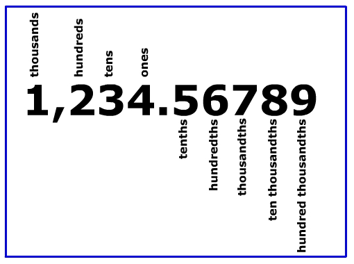

# Positional number

[Refer to Wikipedia: Positional notation](https://en.wikipedia.org/wiki/Positional_notation)

We often hear that `ones place`, `tenth place`, `hundreds place` or more. Here is the graph helps easily to understand.

