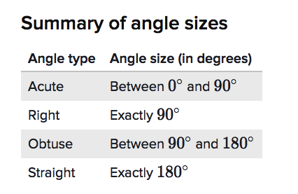

# Triangle types

[Refer to Khan academy: Triangle types](https://www.khanacademy.org/math/basic-geo/basic-geometry-shapes/basic-geo-classifying-triangles/a/types-of-triangles-review)

### Types by side length
- `Scalene triangles` with all different sides   （sounds "scale-lin")
- `Isosceles triangles` with 2 equal sides   (sounds "i-saw-sillys")
- `Equilateral triangles` with 3 equal sides  (sounds "e-qui-lateral")

### Types by angles
- `Acute triangles` with 3 acute angles
- `Obtuse triangles` with 1 obtuse angle
- `Right triangles` with 1 right angle.

## Angle types 
Types of angles: `acute`, `right`, `obtuse`(sounds "ob-tuse"), and `straight`.

