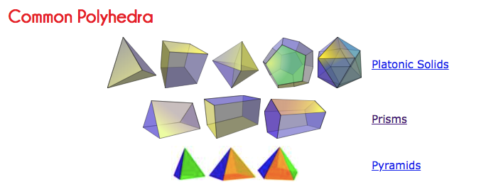
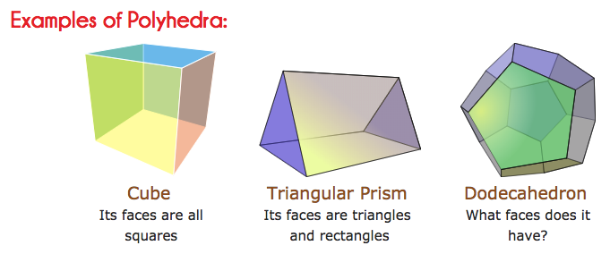
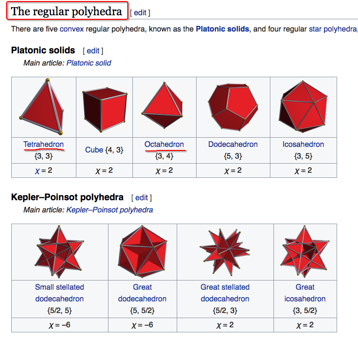

# Polyhedra - 3D shape

Polyhedra, or Polyhedrons is plural for Polyhedron. means a 3D shape with surfaces all flat.
Examples: `Cube`, `Triangular Prism`, `Pyramids`, `Tetrahedron`

More about the list of polyhedrons: [Animated Polyhedron Models](http://www.mathsisfun.com/geometry/polyhedron-models.html)

[`Refer to math is fun: Polyhedron`](http://www.mathsisfun.com/geometry/polyhedron.html)

[Refer to Khan academy lession.](https://www.khanacademy.org/math/basic-geo/basic-geo-volume-sa/basic-geometry-surface-area/v/nets-of-polyhedra)

Regular polyhedrons: 

