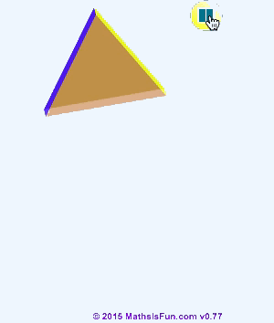
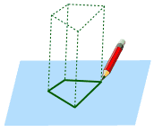
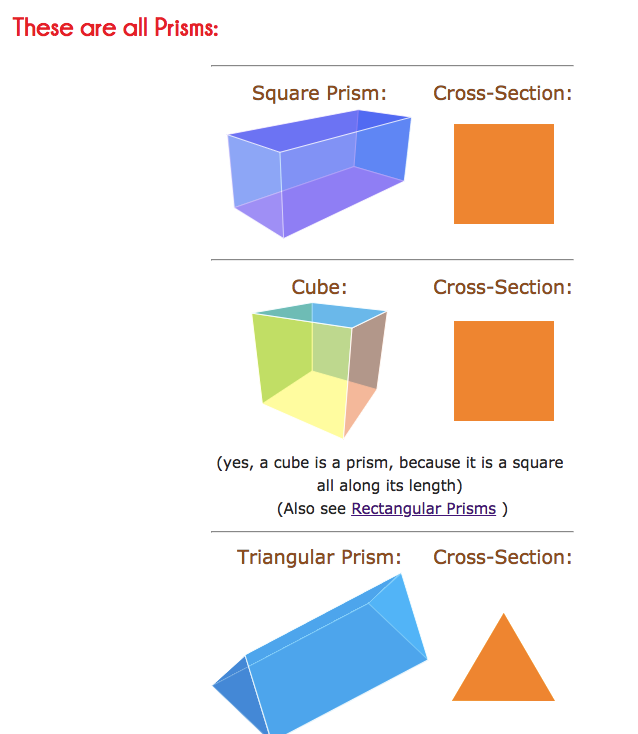

# Prisms (3D shape)

A `Prism` is a 3D shape, which could be stretch out from a 2D shape with sides all straight. The 2D shape is called `Cross-Section`.
A prism is a `polyhedron`, which means all faces are flat!

[Refer to math is fun: Prisms](http://www.mathsisfun.com/geometry/prisms.html)  - 3D shape

