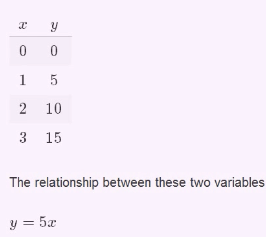

# Dependent variables & independent variables

[Refer to math is fun: dependent variable](http://www.mathsisfun.com/definitions/dependent-variable.html)
[Refer to math is fun: independent variable](http://www.mathsisfun.com/definitions/independent-variable.html)

Understand:
- `Independent variables`: **_Input_** value of a function. (usually x)
- `Dependent variables`: **_Output_** value of a function. (usually y)

