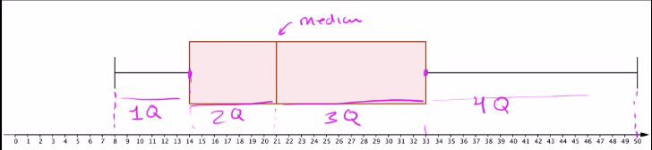
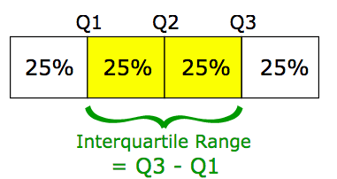
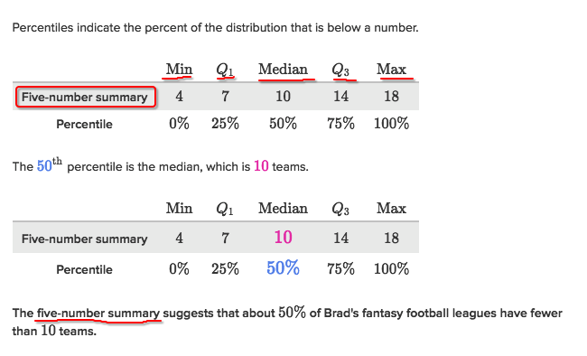
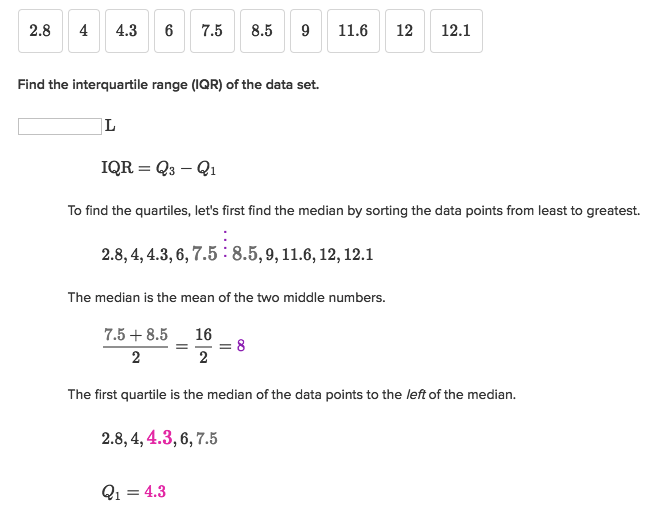

# `Box plots` and `Quartiles`  (STATS: Distribution graph)
It's also called `Box and whisker plots`, or `Five-number summary`.

[Khan lecture 1.](https://www.khanacademy.org/math/probability/data-distributions-a1/box--whisker-plots-a1/v/reading-box-and-whisker-plots)
[Khan lecture 2.](https://www.khanacademy.org/math/probability/data-distributions-a1/box--whisker-plots-a1/v/interpreting-box-plots)
[Maths is for fun Wiki.](http://www.mathsisfun.com/data/quartiles.html)

## [`Five-number summary`](https://www.khanacademy.org/math/probability/data-distributions-a1/box--whisker-plots-a1/e/interpreting-quartiles-on-box-plots)

## Interquartile range (IQR)  (STATS: Box plot)

[Refer to Khan academy.](https://www.khanacademy.org/math/probability/data-distributions-a1/summarizing-spread-distributions/v/calculating-interquartile-range-iqr)

### Example 

### Example

