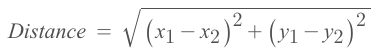
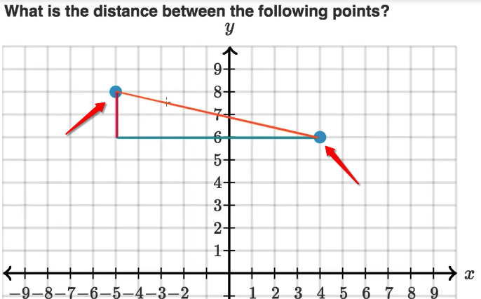
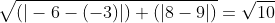
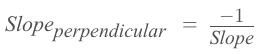
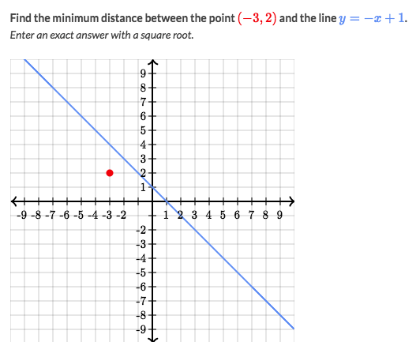
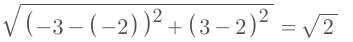

# Distance between points & lines

## Distance of two points on x-y axis?
[Refer to Khan academy lecture: pythagorean-theorem-distance](https://www.khanacademy.org/math/basic-geo/basic-geometry-pythagorean-theorem/pythagorean-theorem-distance/v/example-finding-distance-with-pythagorean-theorem)

▼ Just to apply the `Pythagorean Theorem`:

### Example
`What is the distance between (-6, 8) and (-3, 9) ?`
Solve:
- Easy way to do this:
- Make a triangle with two points same with the given points, and solve the length of the triangle.

- So to solve the example, just like this:

## Distance between point & line

[Refer to Khan academy: Distance between point & line](https://www.khanacademy.org/math/geometry-home/analytic-geometry-topic/distance-between-a-point-and-a-line/v/distance-between-a-point-and-a-line)

`Slope of a perpendicular line` is the `Negative Inverse of the slope of the given line`.

Strategy:
- Draw a perpendicular line form the point to the given line.
- Find out the linear equation for this perpendicular line by:
    - Find the slope: which is the `Negative Inverse of the slope of the given line`:
    
    - Find the shift: plug in the point's `x & y` coordinates and get the shift
- Set two lines' equations equal and get the `Intersect point's coordinates`.
- Calculate two points distance by `Pythagorean Theorem`:

### Example

Solve:
- Find the perpendicular line from the point to the given line:
    - `Slope = -1/-1 = 1`
    - `y=ax + b` -> `2 = -3*1 +b` -> `b=5` -> `y=x+5`
- Find the intersect: `-x+1 = x+5` -> `x=-2` -> `y=3` -> intersects at `(-2, 3)`
- Calculate distance between two points:

- The answer is `√2`
