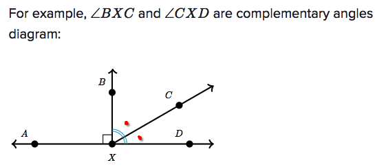
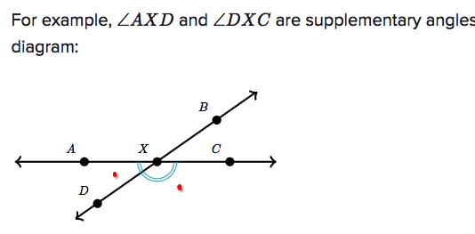
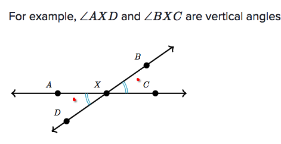

# Complementary, supplementary, vertical angles

 [Refer to Khan academy: Complementary, supplementary, vertical angles](https://www.khanacademy.org/math/basic-geo/basic-geo-angle/vert-comp-supp-angles/a/complementary-and-supplementary-angles-review)

`Complementary angles` are two angles with a **sum of 90°**. A common case is when they form a right angle.

`Supplementary angles` are two angles with a **sum of 180°.** A common case is when they lie on the same side of a straight line.

`Vertical angles` are angles opposite each other where two lines cross. A pair of vertical angles **have the same measure** of angle.

