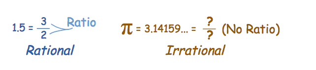
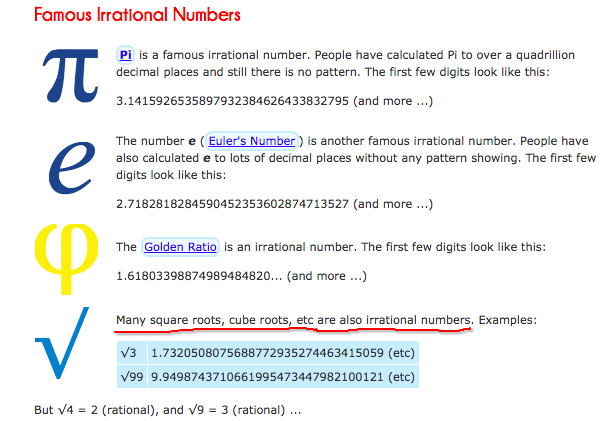

# Rational & irrational numbers

> A rational number can always be expressed as a `fraction of two integers`.
vice versa, a irrational number cannot be expressed as a fraction of two integers.

[Refer to math is fun: Rational & irrational numbers](http://www.mathsisfun.com/irrational-numbers.html)

`A square root of a non-perfect square` is an irrational number, because it cannot be expressed as the fraction of two integers.

