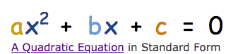
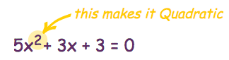
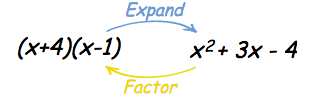
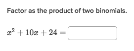
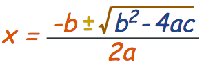
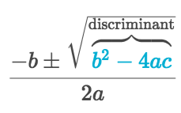
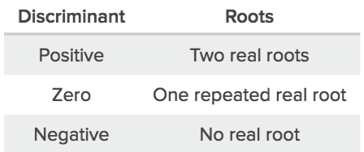
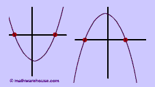
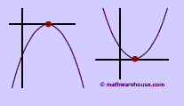
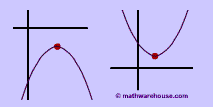

# Quadratics

[`Refer to math is fun: Quadratics`](http://www.mathsisfun.com/algebra/factoring-quadratics.html)

## Different forms a quadratic
> There're many tricks to convert one form to another, mainly depends on what information we have and what information we'd like to get.

Common forms for quadratic as below:
- `Standard form`: 
- `Two binomials form`: Could get two solutions without calculator.
- `Perfect square form`: Could get the positions of `vertex` by only eyeballing it. In another way, you could tell how much the graph was moved from the `origin point`.

## What is the `Solutions` to the quadratic
> The `solutions` to the Quadratic Equation are where it is equal to **ZERO.**

They are also called **`ROOTS`,** or sometimes **`ZEROS`**, or **`REAL ZEROS`**, OR **`REAL NUMBER ZEROS`**, or **`DISTINCT REAL NUMBER ZEROS`**.
Graphically, when the graph touches `x-axis`, the point is **`A SOLUTION`** to the quadratic equation.

There're different ways to get solutions for the quadratic:
- Factor the quadratic as a product of `two binomials`
- Re-group the quadratic, and then factor it
- Use `Quadratic Formula`.

## To factor a quadratic as the product of two binomials
> To find out the answer quickly and get intuition of it step by step, visit this cheat online solver: [Cymath](https://www.cymath.com/).

It's easy to expand product of two binomials to a quadratic, but tricky to factor them back.

What we should do is, in the standard quadratic form `ax² + bx +c = 0`, we are to:
- Find the two common factors of "c"
- Be sure the sum of two factors equals to "b"
As the example below, factors of "c" could be 4 and 6, and the sum of them is 10. So the answer is `(x+4)(x+6)`

## To factor quadratics by re-grouping (to factor more complicated quadratics)

[Refer to khan academy: factoring-by-grouping](https://www.khanacademy.org/math/algebra/polynomial-factorization/factoring-quadratics-2/a/factoring-by-grouping)

> When the coefficient of the 2nd degree term is not 1, things get more complicated.

[Khan notes 1.](https://www.khanacademy.org/math/algebra/polynomial-factorization/factoring-quadratics-2/a/factoring-by-grouping) 
[Khan notes 2.](https://www.khanacademy.org/math/algebra/polynomial-factorization/factoring-quadratics-2/a/factoring-quadratics-leading-coefficient-not-1)

The way to do it is, in the standard form of `Ax²+Bx+C`:
- Find two numbers add up equal `B`
- The product of the two numbers should equal to `A×C`
- Regrouping `Bx` to two terms of `x` with the two number.

## Use `Quadratic formula` to solve equation

[Refer to math is fun: quadratic-equation-derivation](http://www.mathsisfun.com/algebra/quadratic-equation-derivation.html)

> If we can't easily `factor the quadratic`, we have to use the `ultimate formula`:

It's an **universal** method for solving any quadratic equation.

## `Discriminant` of a quadratic

[Refer to khan academy: discriminant-review](https://www.khanacademy.org/math/algebra/quadratics/solving-quadratics-using-the-quadratic-formula/a/discriminant-review)

> Within the `quadratic formula`, there is a `b2 − 4ac` called `Discriminant`.

[Refers to Mathwarehouse.](http://www.mathwarehouse.com/quadratic/discriminant-in-quadratic-equation.php)

The solutions table as below:

The meaning of it, is to tell us about `the solution of a quadratic`:
- when `b2 − 4ac` is **POSITIVE**, we get **`TWO Real solutions`**. (It touches `x-axis` twice.)

- when it is **ZERO** we get just **`ONE Real solution`**. (Its `vertex` is on `x-axis`.)

- when it is **NEGETIVE** we get **`TWO Complex solutions`**. (It won't touch `x-axis` at all.)

