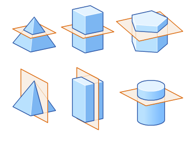
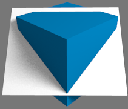
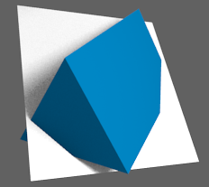
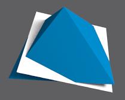
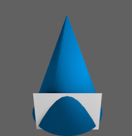

# Cross Sections (GEOMETRY)

[Refer to math is fun: Cross Sections](http://www.mathsisfun.com/geometry/cross-sections.html) (Geometry)

`Cross sections` is a interesting geometry problem, it let you thinks about how to slice a 3D solid shape into some 2D shapes, for instance:
- Slice a cube into:
    - `triangle` (3 sides)
    - `square` (4 sides)
    - `rectangle` (4 sides)
    - `pentagon` (5 sides)
    - `hexagon` (6 sides)
- Slice a pyramid into:
    - `triangle` (3 sides)
    - `square` (4 sides)
    - `rectangle` (4 sides)
    - `trapezoid`  (4 sides)
    - `pentagon` (5 sides)
- Slice a triangular prism into:
    - `triangle` (3 sides)
    - `square` (4 sides)
    - `rectangle` (4 sides)
    - `pentagon` (5 sides)
- Slice a cylinder into:
    - `circle` (no straight sides)
- Slice a cone into:
    - `triangle` (3 sides)
    - `circle` (no straight sides)

Note:
- To slice it must be using a plane to cut through.
- You can not only slice the 3D shape horizontally and vertically, but also any angle you like to get it. 

> Slice a `cube` to get a `pentagon`:

> Slice a `triangular prism` to get a `pentagon`:

> Slice a `right pyramid` to get a `pentagon`:

> Slice a `cone` to get `Ellipse`:

> Slice a `cone` to get a `parabola`:

