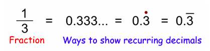
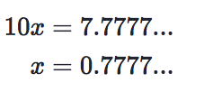
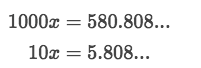
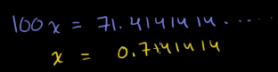
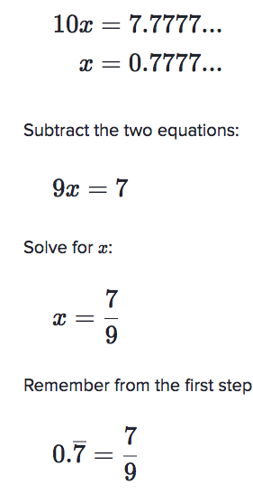
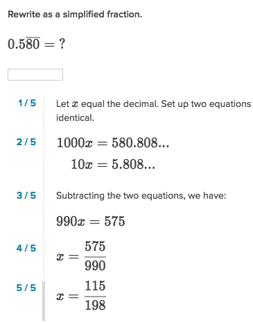

# Convert `Repeating decimal` to fraction

 [Refer to khan academy: Convert `Repeating decimal` to fraction](https://www.khanacademy.org/math/cc-eighth-grade-math/cc-8th-numbers-operations/cc-8th-repeating-decimals/a/writing-repeating-decimals-as-fractions-review)

There're some [`repeating decimals`](https://en.wikipedia.org/wiki/Repeating_decimal) or [`recurring decimals`](https://en.wikipedia.org/wiki/Repeating_decimal), it's way more easier to write down with a fraction. 

[Khan lecture 1.](https://www.khanacademy.org/math/cc-eighth-grade-math/cc-8th-numbers-operations/cc-8th-repeating-decimals/v/coverting-repeating-decimals-to-fractions-1)
[Khan lecture 2.](https://www.khanacademy.org/math/cc-eighth-grade-math/cc-8th-numbers-operations/cc-8th-repeating-decimals/v/coverting-repeating-decimals-to-fractions-2)

An online solver here:
[Calcul.com](http://www.calcul.com/show/calculator/recurring-decimal-to-fraction?i=0.[7])

#### The trick to do so is, to set up two numbers multiplied by 10 or 100 or 1000 or greater, letting their repeating part to fit to each decimal places. Like this:

or this,

or even this,

Here're some examples to convert repeating decimals to fraction:
- For simple repeating: set the number as x, then for example:

- For more decimals repeating:

