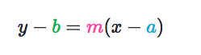

# `Point-slope form of linear equation`

[Refer to khan academy: `Point-slope form of linear equation`](https://www.khanacademy.org/math/algebra/two-var-linear-equations/point-slope/a/point-slope-form-review)

We all know the `slope-intersect form` of a linear equation is `y = mx + c`, which `m` is the `slope of line`, `c` is the constant represent the `y-intersect of the line`.
And we can convert it to another form: 

which contains `m` for the slope of line, and point `(a,b)` for the point the line goes through.

Sometimes we only know the slope and an information of a point, so that can make us an linear equation too, simple like that.

Example:
Q: Write the point-slope equation of the line that passes through (7,3) whose slope is 2.
Solve:
As for the `point-slope form` of linear equation `y - b = m(x - a)`, we can rewrite it to:
```py
y - 3 = 2(x - 7)
```
