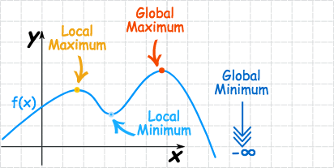

# `Maxima` and `Minima` of Functions

[Refer to math is fun: `Maxima` and `Minima` of Functions](http://www.mathsisfun.com/algebra/functions-maxima-minima.html)

- `Absolute maximum`: means the **greatest** value of the function `f(x)`.
- `Absoute minimum`:  means the **least** value of function `f(x)`.
- `Relative maximum` or called `Local maximum`: means **the `top of a hill`** on the function's graph.
- `Relative minimum` or called `Local minimum`: means **the `bottom of a valley`** on the function's graph.
