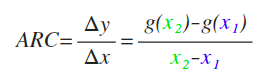
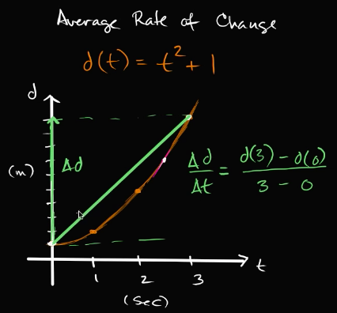
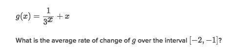
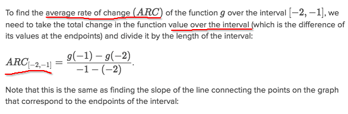
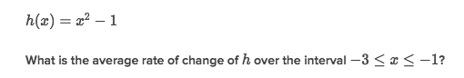
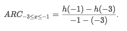

# `ARC`: Average rate of change
Mind that: it's very basic idea for `Differential calculus`.

- For non-linear function, it means the `Average slope` for a specified domain.
Because the slope is almost always changing in a non-linear function, and we have to specify a range or a domain then to get the average slope of this part of function.
- For a linear function, the `Average rate of change` just means the only one `slope`, which is constant.

For example:

We specify a domain on x-axis that from 0 to 3, aka. [0,3]. To know the `average rate of change` or the `average slope`, we can just directly draw a line connecting two points, and get the slope of this line.

### Quiz 1:

Solve:

### Quiz 2:

First to get the x's interval for [-3,-1].
Then we are to apply this equation to get `ARC`:

