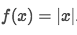
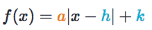
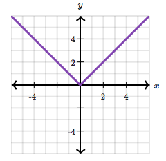
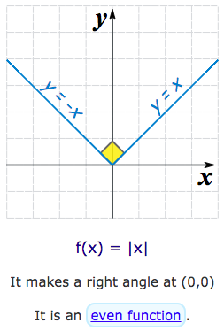
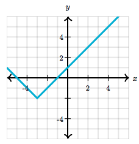
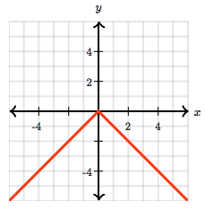
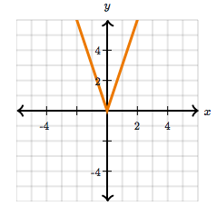

# `Absolute value graphs` (Transformation)

[Refer to Khan academy: `Absolute value graphs`](https://www.khanacademy.org/math/algebra/absolute-value-equations-functions/graphs-of-absolute-value-functions/a/absolute-value-equations-and-graphs-review)

To understand this idea, need to review the previous knowledge of `Transformation` of graphs, including `translation`, `rotation`, `reflection`, `dilation`. Also need to know the `scale factor` of dilation.

For a simplest form of an `absolute value equation`, it can be represented as:

And the most common use for this idea, is in `Quadratic`:
`y=x²`

And the general form of an `absolute value equation`:

In the equation, 
- The sign of `a`, negative sign of `a` means the graph is **flipped** by `x-axis`.
- `a` is the `scale factor` of the graph, equals to `g'(x)÷g(x)`.
- `h` is distance of `moving right`, should be **subtracted** by `x`.
- `k` is distance of `moving up`, should be added by `y`.

Notice that:
The `h` is confusing sometime ---- 
it's the distance of **moving right**, 
and should be **subtracted** from `x`. 
Subtracted ,subtracted, subtracted!
For understanding why is it subtracted, review this [Khan lecture](https://www.khanacademy.org/math/algebra/absolute-value-equations-functions/graphs-of-absolute-value-functions/v/shifting-absolute-value-graphs) in 2 minutes.

## Simplest equation `y = |x|`

## Shifted(Translated) equation `y = |x + h| + k`

## Flipped(Reflected) version `y = - |x|`
It's only flipping by the `x axis`.

## Scaled(Dilated) equation `y = a |x|`

