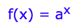
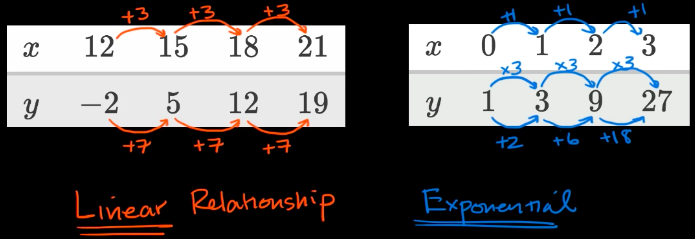

# `Linear growth` vs. `Exponential growth`

[Refer to khan academy: `Linear growth` vs. `Exponential growth`](https://www.khanacademy.org/math/algebra/introduction-to-exponential-functions/exponential-vs-linear-growth/v/exponential-vs-linear-growth)

Quite a bit like the `Arithmetic sequences` vs. `Geometric sequences`,

except in `Exponential relationship`, it's using a `common exponent`,
instead of using a `common ratio` in the `geometric sequences`.

~for which `linear relationship` and `exponential relationship` refers to the combination of `x-sequence` and `y-sequence`.~

The term `relationship` is applying to the value of `f(x)`, aka. the `y`. 
If each value of `y` could have a `constant gap`,  then the function `f(x)` has a linear relationship.
If each value of `y` could have a `constant ratio` or `constant exponent`, then the function `f(x)` has a exponential relationship.

