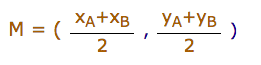
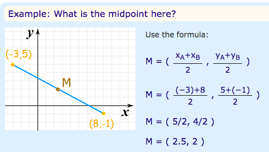

# Midpoint of a Line Segment

[Refer to math is fun: Midpoint of a Line Segment](http://www.mathsisfun.com/algebra/line-midpoint.html)
The midpoint is halfway between the two end points of the line segment.

