# `Inverse functions`

[Refer to math is fun: `Inverse functions`](http://www.mathsisfun.com/sets/function-inverse.html)

> If a `function` means `Map to`, then `inverse function` means `Map back`. `f(x)=y` maps `x` to `y`, then `f'(y)=x` maps `y` back to `x`. Note that `f'` is the inverse function of `f`.

[Khan notes.](https://www.khanacademy.org/math/algebra2/manipulating-functions/verifying-that-functions-are-inverses/a/verifying-inverse-functions-by-composition)

When we have a function, it means we have a `mapping rule`. In this rule, we can map `x` to `y`, expressed as `f(x) = y`. But if we know `y`, how can we map back to `x`? 

## Identify inverse functions by composition

[Refer to khan academy: Identify inverse functions by composition](https://www.khanacademy.org/math/algebra2/manipulating-functions/verifying-that-functions-are-inverses/a/verifying-inverse-functions-by-composition)

> To verify two functions are inverse, we can compose them.

If `f(g(x))` = `g(f(x))`, then they are inverse.

## `invertible functions`

[Refer to khan academy: `invertible functions`](https://www.khanacademy.org/math/algebra2/manipulating-functions/invertible-functions/a/intro-to-invertible-functions)

> Not all functions have inverses. Those who do are called "invertible."

If a function `f(x)` maps `x` to `y`, and another function `f'(y)` can help us mapping `y` back to `x`, 
then the function `f(x)` is `INVERTIBLE`. 
If not, then it is NOT invertible.

### `Horizontal line test`
On the graph of function `f(x)`, if we can draw a `horizontal line` and ends up touches the graph **more than once**, we could say the function is **NOT INVERTIBLE**.

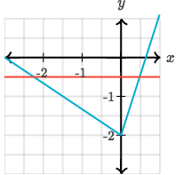

## Inverse trig function word problems

### EXAMPLE 
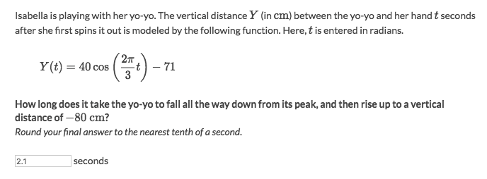
Solve:
- Set equation `Y(t) = −80`
- Simplify equation and solve for all possible solutions:
    - `base solution` as `θ = 1.7911 + 2πn` 
    - Use trig identity `cos(θ) = cos(2π - θ)` to get second solution as `θ = 4.485 + 2πn`.
- Replace θ with the expression of `t` and solve for t:
    - `t*2π/3 = 1.7911 + 2πn` , and solve it to get `t = 0.9 + 3n`
    - `t*2π/3= 4.485 + 2πn`, and solve it to get  `t = 2.1 + 3n`
- Study the graph of trig function (review the `Sinusoidal Functions`), get informations:
    - Max at `(0, -31)`
    - Min at `(1.5, -111)`
    - Period is `2π/(2π/3)` and get the period is `3`
- According to the situation we know:
    - It passed the `1st Min` and is before the `2nd Max`
    - So it's over `1.5 sec` at Bottom and not yet `3 sec` at top.
- So within the range (1.5, 3), filter out invalid solution, `2.1` is the answer.

### EXAMPLE
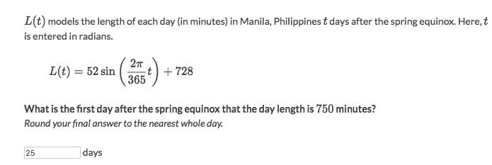
Solve:
- Simplify and solve to get solutions:
    - `θ = 0.423 + 2πn`
    - `θ = 2.718 + 2πn`, (with trig identity `sin(θ) = sin(π-θ)` when θ is positive)
- Replace θ with expression of t:
    - `t = 24.57 + 365n`
    - `t = 157 + 365n`
- Study the graph of trig function and get informations:
    - Period: 365
    - Y-intersect (Midline) at: `(0, 728)`
    - Max (right after Y-axis) at: `(365/4, 780)`
- Since `750` is not yet the Max `780`, so it's EARLIER than `365/4` aka.`91.25`.
- Filter out the `157` which is later than `91.25`, so the `24.57` is the answer.

### EXAMPLE
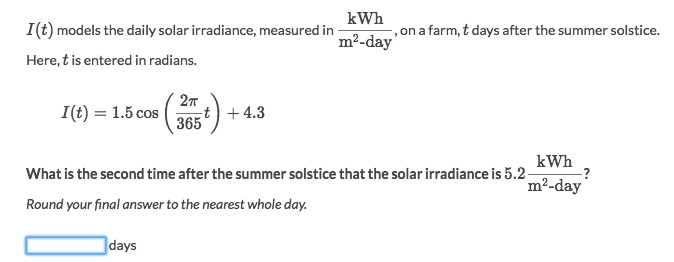
Solve:
- Set equation to `I(t)=5.2`
- Simplify equation to:
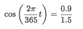
- Get `θ ≃ 0.9273 Rad`
- Get First solution:
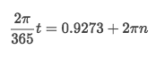
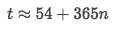
- Use the trig identity for second solution: `cos(θ) = cos(2π−θ)`.
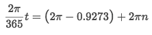
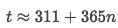
- The answer for SECOND TIME it hits 5.2 is `311 days`.

## Inverse trig function all possible solutions

### Example
> Find all possible solutions: `cos(x)=0.15`

Solve:
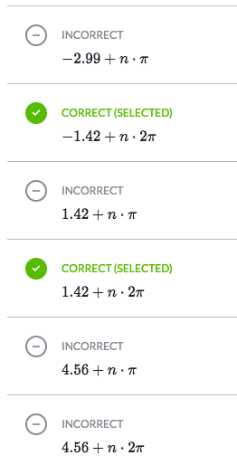
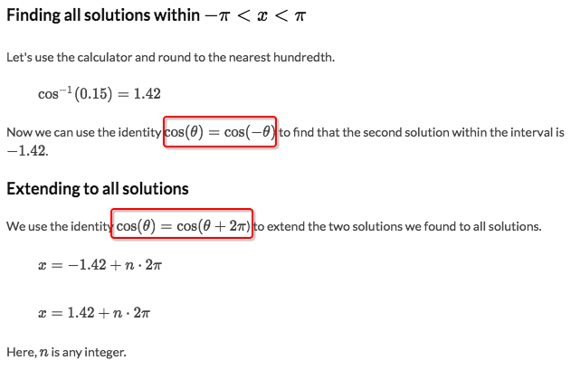
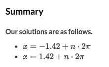

