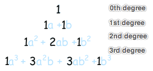
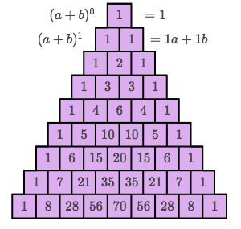
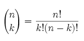
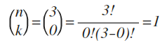
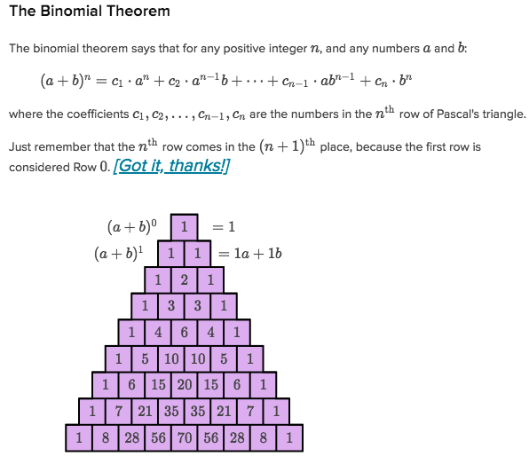
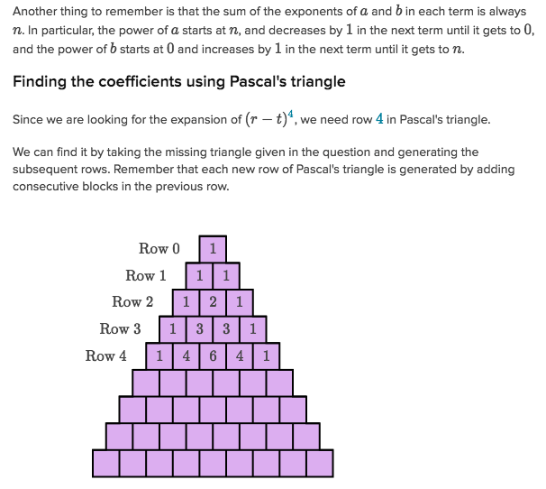
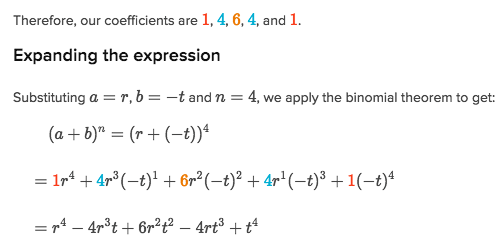

# `Binomial theorem`

[Refer to math is fun: `Binomial theorem`](http://www.mathsisfun.com/algebra/binomial-theorem.html)

> It actually is a hard term to understand at beginning.  One way to do this, is to learn how to solve first, then learn what's the theory behind it.

For a binomial `(a+b)ⁿ`, we've tried to expand with 2nd degree, a quadratic.
But to expand it with higher degrees, like `(a+b)⁷`, 
it WON'T BE easy at all to multiply one by one by one. 

That's where the `Binomial theorem` comes to place.

[Math is fun.](http://www.mathsisfun.com/algebra/binomial-theorem.html)
[Khan lecture: Expanding binomials w/o Pascal's triangle](https://www.khanacademy.org/math/algebra2/polynomial-functions/binomial-theorem/v/binomial-expansion-algorithm)

> All `binomials (a+b)ⁿ` follow this theorem.

## How to solve 
> It's even easier to learn how to solve first than how to understand.

For a given binomial `(a+b)ⁿ`, let's say it's `(a+b)³`, to expand it
1. List **(n+1)** `base terms`:
```py
ab + ab + ab + ab
```
Notice that, **every base is the same: `ab`, and there're amount of `n+1` terms**.

2. Add `exponents` to each factor of each base term:
```py
a³b⁰ + a²b¹ + a¹b² + a⁰b³
```

Notice that, exponents of `a` are always **degrading**, and of `b` are always **upgrading**.

3. Add `coefficient` the each term:
Here it is the MOST DIFFICULT part to understand. We could either find the coefficient from `The Pascal's Triangle`, or calculating the formula from `Binomial Theorem`.

> `Pascal's Triangle`. Just find the row has the same degrees with `n`, and pick up each number as coefficient:




> **`Binomial theorem coefficient formula`**:

It's called `n choose k`, what it represents it the `the term k of the Row n`.

In this case, `(3 choose 2)` the `2nd term in 3rd power row`, apply to the formula, we'll get `3`, which is exactly the same in the `Pascal's triangle`.

And let's list the coefficients in terms of `(n choose k)`:
```py
(³₀),  (³₁),  (³₂),  (³₃)
```


And solve out each (n choose k), we get coefficients:
`1 , 3, 3, 1`

So the final result is:
`1a³b⁰ + 3a²b¹ + 3a¹b² + 1a⁰b³`

Simplify it to be:
`a³ + 3a²b + 3ab² + b³`


It has to have understanding of [`factorial`](https://github.com/solomonxie/solomonxie.github.io/issues/44#issuecomment-374487125) and [`Combinations and Permutations`](http://www.mathsisfun.com/combinatorics/combinations-permutations.html) in order to understand this formula.

[Practice.](https://www.khanacademy.org/math/algebra2?t=practice#polynomial-functions)

### Example

Solve





## How to understand 

(Unfinished...)
