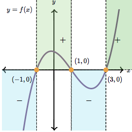
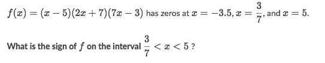
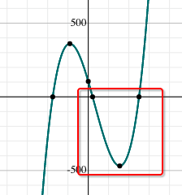

# The `sign` of a polynomial

[Refere to khan academy: The `sign` of a polynomial](https://www.khanacademy.org/math/algebra2/polynomial-functions/zeros-of-polynomials-and-their-graphs/a/positive-and-negative-intervals-of-polynomials)

> The `sign of a polynomial` between ANY two CONSECUTIVE roots is either **always positive** or **always negative**. 

This is because polynomial functions are `continuous functions` (**no breaks** in the graph), which means that the only way to change signs is to cross the x-axis. 

## How to know the sign of a polynomial on each interval?
Just try a number in this interval and calculate the result, see its sign.

### Example

Solve:
- Since the function value between two **Zeros** can be either Always negative or Always positive,
- So just simply try out any x-number between the two zeros: f(1)=-144 <0, so it's negative.

