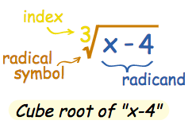
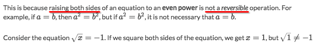
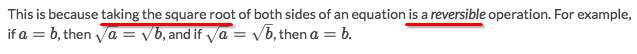

# `Radical Equation`

Means an equation or an expression that has a square root, cube root, etc.
The symbol is `√`.

## `Extraneous solutions` of radical equations

[Refer to khan academy: `Extraneous solutions` of radical equations](https://www.khanacademy.org/math/algebra2/radical-equations-and-functions/analyzing-extraneous-solutions-of-square-root-equations/a/analyzing-extraneous-solutions-of-square-root-equations)

> Whenever you raise both sides of an equation to an even power, you must check for extraneous solutions.

However, taking the square root of both sides of an equation does not introduce the possibility of extraneous solutions.

When you're to `square` something, you may LOOSE some information: the sign of the squared term.

So when you're solving a `radical equation`, you might need to take the root out of a `even exponent` number.
Since you lost the information about the `sign` of the term, you can't be sure it's **negative** or **positive**.
Here's the problem, If you didn't correctly guess the `sign`, the solution you got for the equation will be incorrect as well.
We call it **`Extraneous solution`**.

So every time you solve a radical equation, you have to examine each solution. 
Take them back to the equation and see if it works out.

## `Principal Square Root`
> Means the `Positive square root`.

When you say a square root of a number, you meant BOTH the positive and negative root.
But when you put a `√` sign before the number, it means you want a POSITIVE ROOT.
And you read it `Principal square root` of the number.

The square roots of 36 are 6 and −6, 
and the `Principal Square Root` is `√36`, which just means the one that is not NEGATIVE!
see [Khan lecture](https://www.khanacademy.org/math/algebra2/radical-equations-and-functions/graphs-of-radical-functions/v/graphs-of-square-root-functions) and [Math is fun](http://www.mathsisfun.com/algebra/square-root.html).
