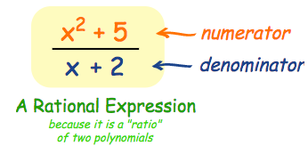
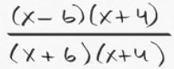
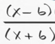
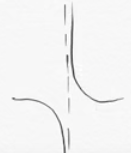

# `Rational Expressions`

[Refer to math is fun: `Rational Expressions`](http://www.mathsisfun.com/algebra/rational-expression.html)

> Or called `Rational functions`. It's a `fraction of two polynomials`. And a fraction of two constant numbers will also be fine, because a polynomial could be a constant number.
We call the numerator the **`TOP`**, and the dominator the **`BOTTOM`**

## `End Behaviour` of rational functions

[Khan lecture.](https://www.khanacademy.org/math/algebra2/rational-expressions-equations-and-functions/end-behavior-of-rational-functions/v/end-behavior-of-rational-functions)

## `Removable Discontinuity`

[Refer to khan academy: `Removable Discontinuity`](https://www.khanacademy.org/math/algebra2/rational-expressions-equations-and-functions/v/discontinuities-of-rational-functions)

> A function could have some `breaks`, makes `discontinuities` of the function. 
At this break, you could either draw a line called `vertical asymptote`, or have a `removable discontinuity`.

For example, `f(x) = 1/x`, the `x` MUSTN'T be `zero`, so the domain of this function is `all real numbers except 0`. So there's a `break` or a `discontinuity` of this function.

Another example,

We know that in the `dominator`, the `x` can't be `-6` or `-4` because the dominator mustn't be zero. And `-6 and -4` makes **`discontinuities`** of the function.

Further more, we could **CANCEL OUT** `(x+4)` from both numerator and dominator. 
And this makes `(x+4)` REMOVABLE, so that the `-4` become a **`Removable discontinuity`**.

Now what's left here is this fraction:

We see the `-6` still makes the whole function `undefined`, and makes `discontinuity`.

So at the moment, we could DRAW a `vertical line` through the `-6` point, that the function could never touch.
So we call this line a **`vertical asymptote`**.

1.
> So for the conclusion, a solution for the `x` that makes the function `undefined`, 
it could either make a `vertical asymptote`, or a `removable discontinuity`.

2.
> If the numerator and the denominator share either root exactly once, then fff will have a removable discontinuity at that root.

3.
> If the denominator has multiple copies of either of the numerator's roots, then fff will have a vertical asymptote at that root.
