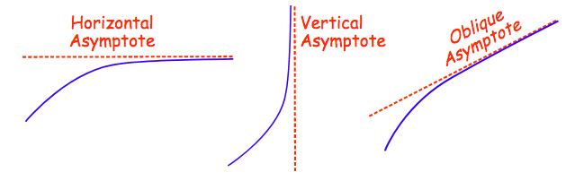
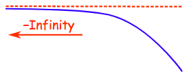
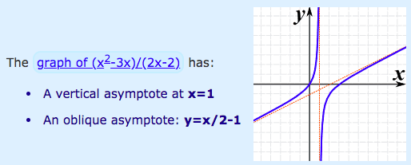
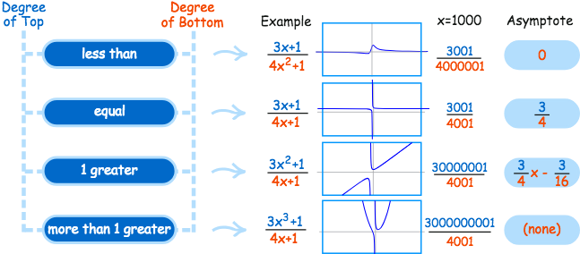
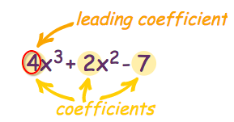
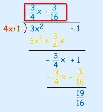
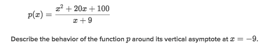
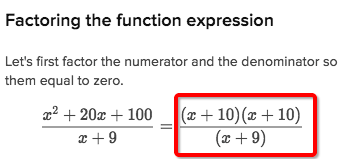
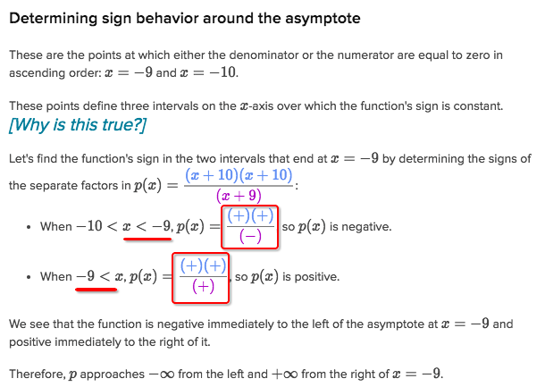

# `Asymptote` of Rational Expressions

# [`Asymptote` of Rational Expressions](http://www.mathsisfun.com/algebra/asymptote.html)

> It's a **`straight line`** that some other curve line is tend to approach to, and never will touch.
It's a fairly important for the `rational expressions`.

They're going to be infinitely close but NEVER end up together.

Types of `asymptotes`:

The `direction of asymptote` could go another way around as well:

> The `asymptote` only make sense to the `Rational Expressions`.

## Amount of `asymptotes`

A `rational express` could have multiple asymptotes, but following these rules:
- **ANY** amount of `vertical asymptotes`
- at most **ONE** `horizontal asymptote` or **ONE** `oblique asymptote`

## [How to find the `Asymptotes`](http://www.mathsisfun.com/algebra/rational-expression.html)

Refer to [Maths is fun: Rational Expressions](http://www.mathsisfun.com/algebra/rational-expression.html).
[Youtube mathbff.](https://www.youtube.com/watch?v=0cPptjKTR7M)

### Finding `Vertical Asymptotes`
> It's fairly easy. And there could be multiple numbers of that.

Just simplify the fraction of polynomials, and look at the BOTTOM part, 
find EACH value of `x` makes the `dominator` as `undefined`, 
and you can draw a VERTICAL LINE through each `x` value, that would become a `Vertical asymptote`.

### Finding `Horizontal asymptote` and `Oblique/Slant asymptote`
> It depends on the `degree` of the `top` vs `bottom` polynomial.

There're FOUR possible cases need to discuss differently:

- Degree: Top < Bottom. (e.g., x² and x⁵)
The `Horizontal asymptote` is `y = 0`.

- Degree: Top = Bottom. (e.g., x² and x²)
The `Horizontal asymptote` is `y = (c1 / c2)`. (`c` means coefficient)
`c1` is the **`Leading Coefficient`** of the Top , the `c2` is the bottom's. 
`Leading coefficient` is of the term of polynomial that has highest degree.

- Degree: Top > 1 + Bottom. (e.g., x⁵ and x²)
There is no horizontal nor oblique asymptote in this case.

- Degree: Top = 1 + Bottom. (e.g., x² and x³)
The `Oblique/Slant asymptote` is `y = p1 / p2` (p means Polynomial)
It only gets the `Oblique asymptote`, instead of horizontal one.
Divide `Top polynomial` by `Bottom polynomial` by using `Polynomial Long Division`,
**IGNORE** the `remainder`.

For example, the rational function is `f(x) = (3x²+1)/(4x+1)`, and we do long division:

Ignore the remainder, we gets the `Oblique asymptote` is `y = (3/4)x - (3/16)`

## `Analyze vertical asymptotes of rational functions`

[Refer to Khan academy.](https://www.khanacademy.org/math/algebra2/rational-expressions-equations-and-functions/modal/e/analyze-vertical-asymptotes-of-rational-functions))

### Example

Solve:

