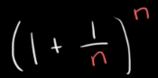
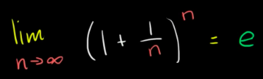

# `𝑒` as a limit

When you do this formula:

Whatever the `n` is, no matter how large `n` goes, 
the value of the formula will NOT go insanely big, it will only get closer and closer to the number `2.7...`.

So we call the number it is approaching as `𝑒`. And express the idea as below:

