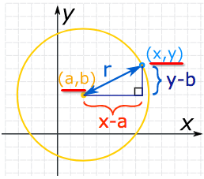
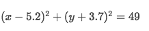

# Equations of `Circle`

> Definition of circle: The set of all points on a plane that are a fixed distance from a center.

[Maths is fun.](http://www.mathsisfun.com/algebra/circle-equations.html)


## Standard Equation of circle
Since the definition of circle is the set of all points with same distance to the center,
so we assume any point `(x, y)` on this circle can satisfy this equation:
```py
x² + y² = r²
```

The circle with shift, then it could be like below:
```py
(x - a)² + (y - b)² = r²
```
> It comes straight out of the `Pythagorean theorem` for triangle, that for any point `(x, y)` on the circle has centre at `(a, b)`, to calculate the radius `r`, that equation above is true.


For example, this is a standard equation for circle:


We can eyeball it out, the **CENTER** is `(5.2, -3.7)`, and **RADIUS** is √49, aka. `7`.

## General form of equation of circle
> it's also called `expanded equation for circle`.

```py
x² + y² + Ax + By + C = 0
```


