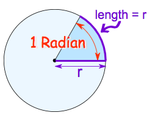
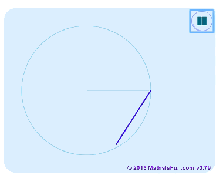
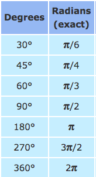

# `Radians`
> It's another measurement method for an angle in a circle.

[Maths is fun.](http://www.mathsisfun.com/geometry/radians.html)

We set an arc that its length is equal to the `radius`, we call this angle `a Radian`.




So, for this measurement, **how many `radians` are in a full circle?**
Just to do `Circumference / Radius`, and we'll get there're `2π` amounts of `radians` in a full circle.

## Conversion of `Radian` and `degree`
A full circle is `360°`, 
so we do `360° / 2π` to get `1 Radian` is equal to `180/π` degree. 
And vice versa, `1 Degree` is equal to `π/180` radian.
There're some examples:
```py
π radians = 180°
2π radians = 360°
0.5π radians = 90°

# Radian =>> Degree
17/18 π radians = (17/18) * 180° = 170°
3 radians = 3 * (180°/π) = 540/π degrees

# Degree =>> Radian
18° = 18° * (π/180) = 0.1π
```


