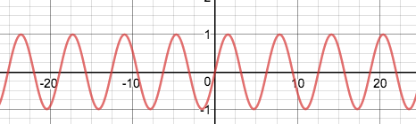
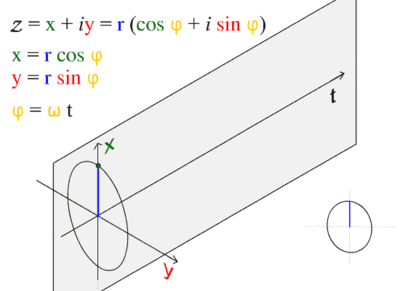
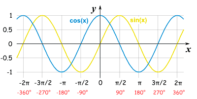
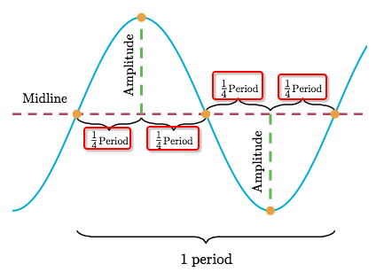
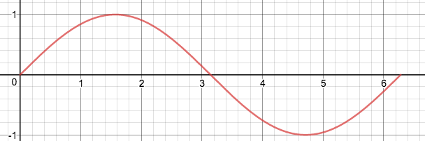
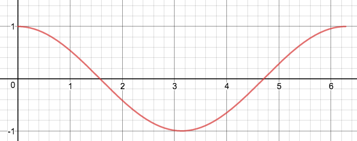
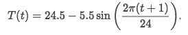
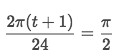
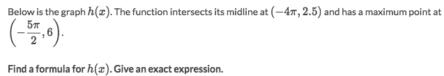

# `Sinusoidal functions` (TRIGONOMETRY)

`Trig functions` like `sine` and `cosine` have `periodic graphs` which we called **`Sinusoidal Graph`**, or **`Sine wave`**.



Every period of `sine wave` is a whole unit circle:




## `Sinusoidal graphs`

[Math is fun: Graphs of Sine, Cosine and Tangent.](http://www.mathsisfun.com/algebra/trig-sin-cos-tan-graphs.html)
[Symbolab example.](https://www.symbolab.com/solver/step-by-step/shift%20y%3Dsin%5Cleft(2x%2B3%5Cright)%2B10)

Graph of `unit sine & cosine function`:



## `Midline, amplitude and period` 
> They're three features of `sinusoidal graphs`.



- `Midline`: is the **horizontal line** that passes exactly in the **middle** between the graph's **maximum** and **minimum** points.
- `Amplitude`: is the **vertical distance** between the **midline** and one of the **extremum points**.
- `Period`: Also called `frequency`, is the **distance** between **two consecutive maximum points**, or two consecutive minimum points (these distances must be equal).

## `Initial period` and how to graph a sinusoidal function
> To graph the whole function, you only need 1 period of the graph, and then just repeat that ever and ever.
And to avoid any confusion, we'd pick the `initial period`, which:
- `sin(x)` that interval is [0,2π], and looks like an `S`. Y-intersect at its midline.
- `cos(x)` that interval is [0,2π], and looks like a `Bow`. Y-intersect at its peak.

You really need to pay attention for the `starting point` of the `S` and the `bow`, it's the great way to figure out the how much the graph shifted on x-axis.

The necessary information to draw the `initial period` :
- Any two of the three position: Max, Min and Midline
- Period
- Phase shift from `initial point`

With these information above, we could figure out all other informations about the period.

### `Initial period of sin(x)`:

> Looks like a `flipped S`.

`Starting point` of the `flipped S` is its **`Midpoint`**, at `(0,0)`, 
`Full period` is `2π`, `Midline` at `y=0`, `Range` is `[1,-1]`.


### `Initial period of cos(x)`:

> Looks like a `bow`.

 `Starting point` of the `bow` is its **`Peak`**,   at `(0,1)`, 
`Full period` is `2π`, `Midline` at `y=0`, `Range` is `[1,-1]`.



## `Phase shift of trig functions`
> `Phase shift` means horizontal shift, or moves on x-axis. It's much harder to understand and calculate than the vertical shift.

Since trig functions(sine, cosine, tangent) are all periodic functions, so it's really CONFUSING with horizontal moving, because it's repeating, and you can't easily tell what happened with the graph.

### Calculate algebraically how much is the Phase Shift
First need to figure out the `starting point` of the `initial period`, and to compare how much it moved from 0 on x-axis.

[Youtube tutorial: How do you determine the phase shifts for sine and cosine graphs](https://youtu.be/eiZCk-A6qVw?t=5m17s)
[Youtube tutorial : Sine Function Phase Shift](https://youtu.be/HHbbi1G_Y4k?t=4m29s)

Since the `initial period` of both sine and cosine functions starts from `0 on x-axis`,
with the formula of function `y = A*sin(Bx+C)+D`,

> we are to set the `(Bx+c) = 0`, and solve for `x`, 

the value of `x` is the phase shift of the graph.

Why do we set `(Bx+c) = 0`?
Because we could imagine the `(Bx+c)` is a whole, and could be `w` of the `sin(w)`.
Since the `initial period` of `sin(w)`, always starts from `0`,
we could say the `starting point of initial period` is `0`, so `w=0`, then `Bx+C=0`.

## `Peak points` (Max & Min)
> Let's call the **`INITIAL PEAKS`**, which is the `peaks` of the `initial period` .

Y-axis position of ALL peaks could be found in the function's **`Range`**, which could also be express as `[Max, Min]` or `[Min, Max]`.
Y-axis position of `Initial peaks`:`[-1, 1]`
or
Y-axis position of `all peaks`:
- Max: `y= Midline_position + Amplitude`
- Min: `y = Midline_position - Amplitude`

[Refer to the step-by-step solution at Symbolab.](https://www.symbolab.com/solver/step-by-step/range%20f%5Cleft(x%5Cright)%3D2sin%5Cleft(2x%2B3%5Cright)%2B5)

X-axis position of `Initial peaks`:
- sin(x):
    - Max: `x=π/2`
    - Min: `x=3π/2`
- cos(x):
    - Max: `x=0`
    - Min: `x=π`

To get the `x position` of these peak points, need to consider the `Phase shift` issue:
1. Whatever in the `sin(...)`, just assume it is standard function `sin(u)`.
2. Match the `x position` of standard function, e.g. `sin(u)` is at Max when `u=π/2`.
3. Solve the equation of `u` to get `x position`, e.g. `sin(2x+3)`, set `2x+3 = π/2` to get `x`.
4. `x` is the `x position` of the peak point of the `initial period`.

### How to find peak points of any period
The Y-axis position of peak points are maintaining **THE SAME** as the period repeats.
The X-axis position of peak points of the number `n` period is:
```py
Initial_peak + n*(Period_length)
```

Example:

**Find the value of `t` when it's at the function's lowest point.**
Solve:
- `Max point` of `-sin(u)` is the `Min point`.
- X-position of the function at Initial Period is `u=π/2`
- Solve the equation `u=π/2` to get `t`:



## Informations of Sinusoidal functions

For the `General sinusoidal function`:
```py
f(x) = A・sin(Bx + C) + D
```
- `Amplitude`: **|A|**
- `Period`: **|2π / B|**
- `Vertical shift`: **D**
- `Midline`: **y=D**
- `Range`: **[-A+D, A+D]**
- `Phase shift`: Set `(Bx+C)=0`, and solve for `x`.
- `Sign of function`: is the SAME sign of the slope of the **ORIGINAL** function's Y-intersect point.

Example:
```
f(x) = - 2sin(2x + 3) + 10
```
- Amplitude: |-2| = 2
- Period: |2π / 2| = π
- Vertical shift: +10
- Midline: y=10
- Range: `[2+10, -2+10]` = [12, 8]
- Horizontal shift: set `2x+3=0`, get `x=-3/2`, so it's shifting `-3/2` from origin.

Example 2:

Solve:
- Midline: `y=2.5`
- Amplitude: `|6-2.5|=3.5`
- Period: Midpoint to Max is 1/4 period, so `1/4 * 2π/B = |-4π - (-5/2)π|`, solve for B gets `1/3`.
- Phase shift: `-4π`. Because the `midpoint` on the left is the `starting point of initial period`

At this moment, our formula is almost finished:
`y = 3.5*sin(1/3 *x +C) +2.5`, so only the `C` is not yet solved.
set `1/3 *x + C = 0`, since , since `-4π` is the `phase shift`, so we set `x=-4π`, solve C gets `4π/3`.
