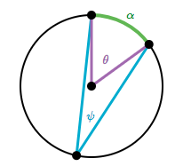
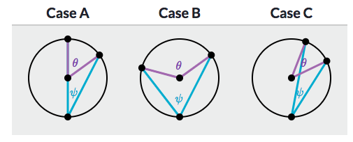
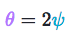
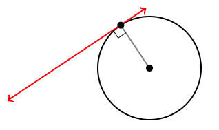
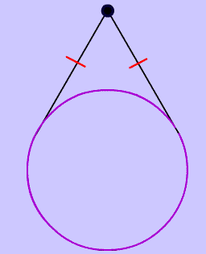
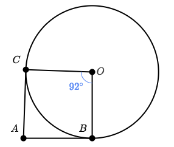

# `Circle`
> "The circle is arguably the most fundamental shape in our universe." - Sal Khan

## `Arc length`
```py
radius × θ = arc length
```

## `Inscribed Angles`
> 



- Inscribed angle's notation: `ψ`, called "si", pronounced "sai".
- Central angle's notation: `θ`, called "theta", pronounced "thay-ta".
- Intercepted arc's notation: `𝞪`, called "alpha".



## `Inscribed Angle Theorem`
> For all `inscribed angles`, `θ = 2ψ`.




## `Tangent line`
> A **line** that is `tangent` to a circle at a particular point is **perpendicular** to the `radius` at that point.



> Two `segments tangent` to a circle from a `common endpoint` are congruent, aka. having the same length.



## `Circumscribed angle`

Angle A is circumscribed about circle O.




