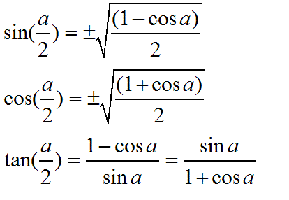

# `All trig identities`

[Refer Khan notes.](https://www.khanacademy.org/math/precalculus/trig-equations-and-identities-precalc/using-trig-identities-precalc/a/trig-identity-reference)
[PDF: (Trigonometry) Trig Formulas.pdf](https://github.com/solomonxie/solomonxie.github.io/files/1872093/Math.Handout.Trigonometry.Trig.Formulas.Web.Page.pdf)

## `Reciprocal and quotient identities`
```py
tan(θ) = sin(θ) / cos(θ)

csc(θ) = 1/sin(θ)
sec(θ) = 1/cos(θ)
cot(θ) = 1/tan(θ)
```

## `Pythagorean identities`
```py
sin²(θ) + cos²(θ) = 1

cos²(θ) - sin²(θ) = cos(2θ)

sec²(θ) - tan²(θ) = 1

csc²(θ) - cot²(θ) = 1
```

## `?? identities`
```py
sin(θ) = sin(π - θ)    #  if θ is POSITIVE.
sin(θ) = sin(-π - θ)   #  if θ is NEGATIVE.

cos(θ) = cos(-θ)

tan(θ) = tan(-π + θ)   #  if θ is POSITIVE.
tan(θ) = tan(π + θ)    #  if θ is NEGATIVE.
```


## `Symmetry and periodicity identities`
```py
sin(-θ) = -sin(θ)
cos(-θ) = cos(θ)
tan(-θ) = -tan(θ)

sin(θ) = sin(2π+θ)
cos(θ) = cos(2π+θ)
tan(θ) = tan(π+θ)
```

## `Angle Addition & Subtraction identities`
```py
sin(a+b) = sin(a)cos(b) + cos(a)sin(b)
sin(a-b) = sin(a)cos(b) - cos(a)sin(b)

cos(a+b) = cos(a)cos(b) - sin(a)sin(b)
cos(a-b) = cos(a)cos(b) + sin(a)sin(b)

tan(a+b) = ( tan(a)+tan(b) ) / ( 1-tan(a)tan(b) )
tan(a-b) = ( tan(a)-tan(b) ) / ( 1+tan(a)tan(b) )
```

## `Double angle identities`
```py
sin(2θ) = 2·sin(θ)cos(θ)

cos(2θ) = cos²(θ) - sin²(θ)
cos(2θ) = 2·cos²(θ) - 1

tan(θ) = 2·tan(θ) / ( 1-tan(θ) )
```


## `Cofunction identities`
```py
sin(θ) = cos(π/2 - θ)
cos(θ) = sin(π/2 - θ)
tan(θ) = cot(π/2 - θ)

cot(θ) = tan(π/2 - θ)
sec(θ) = csc(π/2 - θ)
csc(θ) = sec(π/2 - θ)
```


### `Half angle identities`



