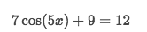

# `Inverse Trig equations`
> Probably it's the most tricky and difficult topic throughout all High School Math.

Prerequisites:
- Unit circle
- Reference angle & Angle in standard position
- Inverse functions
- Radian & degree conversion
- Signs of trig functions

It asks you to solve a trig function like this:

Actually it's asking you to use `inverse trig function` skills.

## Multiple solutions for inverse trig function
> The most difficult part to understand is the multiple solutions. And not all are valid.

e.g. `sin⁻¹(1/2)` means, we know the sine value is `1/2`, and we'd like to get the `arc angle's measure`. But there're multiple `arc angles` could have the very SAME sine value: 
- Counter-clockwise: 30°, 150°
- Clockwise: -330°, -210°.

But for making the function valid, we have to make it to `1-INPUT-1-OUTPUT`.
So we are to filter them out and only keep one solution, by restrict the `angle's measure`.

The `angle's measure` in Sine function is restricted by **DOMAIN**, but in its inverse function, it became **RANGE**.

By filtering with the RANGE, we are to get a **`ONLY-ONE & MUST-ONLY-ONE`** answer.

### Principle value & Calculator
So after filtering out all other solutions, we have only ONE solution, we call it:
The **`Principle Value`** of inverse trig function,
which shows up in any `calculator` when you type it.

## `HOW TO GET ALL POSSIBLE SOLUTIONS`
- First to use a `CALCULATOR` to get the `principle value` as our `base solution`.
- Find the mirror solution of each trig function by `Trig symmetry identities`:
    - `sin(θ) = sin(π - θ)`, if θ is POSITIVE.
    - `sin(θ) = sin(-π - θ)`, if θ is NEGATIVE.
    - `cos(θ) = cos(-θ)`
    - `tan(θ) = tan(-π + θ)`, if θ is POSITIVE.
    - `tan(θ) = tan(π + θ)`, if θ is NEGATIVE.
- Add periodicity to the solution to represent all periodic solutions: `x = θ + 2πn`

#### Example: `sin(x) = 0.65` 
- Use `calculator` to do `arcsin(0.65)` and get principle value: `0.71 Rad`.
- Apply trig identity `sin(θ) = sin(π-θ)` to get the mirror solution: `arcsin(0.65) = π - arcsin(0.65)`, which'd be: `2.43 Rad`.
- With two solutions `0.71 Rad` and `2.43 Rad` and add periodicity, we'll get two full solutions:
    - `x = 0.71 + 2πn`
    - `x = 2.43 + 2πn`

#### Example: `sin(x) = −0.25` 
- Use `calculator` to do `arcsin(-0.25)` and get principle value: `-0.25 Rad`.
- Apply trig identity `sin(θ) = sin(-π-θ)` to get the mirror solution: `arcsin(-0.25) = -π - arcsin(-0.25)`, which'd be: `-2.89 Rad`.
- With two solutions `-0.25 Rad` and `3.39 Rad` and add periodicity, we'll get two full solutions:
    - `x = -0.25 + 2πn`
    - `x = -2.89 + 2πn`

#### Example: `cos(x) = −0.7`
- Use `calculator` to do `arccos(-0.7)` and get principle value: `2.35 Rad`.
- Apply trig identity `cos(θ) = cos(-θ)` to get the mirror solution: `arccos(-0.7) = - arcsin(-0.7)`, which'd be: `-2.35 Rad`.
- With two solutions `2.35 Rad` and `-2.35 Rad` and add periodicity, we'll get two full solutions:
    - `x = 2.35 + 2πn`
    - `x = -2.35 + 2πn`

#### Example: `cos(x)=0.4`
- Use `calculator` to do `arccos(0.4)` and get principle value: `1.16 Rad`.
- Apply trig identity `cos(θ) = cos(-θ)` to get the mirror solution: `arccos(0.4) = - arcsin(0.4)`, which'd be: `-1.16 Rad`.
- With two solutions `1.16 Rad` and `-1.16 Rad` and add periodicity, we'll get two full solutions:
    - `x = 1.16 + 2πn`
    - `x = -1.16 + 2πn`

## `Range of the inverse trig functions`
The range differs for each arc-function:
- `Arcsin(x)=θ`: -90° < θ < 90°,  means angle only exists in Q.1 and Q.4
- `Arccos(x)=θ`: 0° < θ < 180°,  means angle only exists in Q.1 and Q.2
- `Arctan(x)=θ`: -90° < θ < 90°,  means angle only exists in Q.1 and Q.4

Tricks:
> About the signs like `90` and `-90`, 
just to think about the **CLOCKWISE** and **COUNTER-CLOCKWISE**.

## `Special Value of trig function solving`
> With `special trig values`, we really don't need calculator at all, but only to look at the picture of Complete Unit Circle. Or not even that if you can remember it.

Notice: 
`The Complete Unit Circle` only shows `counter-clockwise` angle measures which means `ONLY POSITIVE ANGLES`, 
so you have to do your own math to get the `NEGATIVE ANGLES`, aka. `clockwise angle measures`.

Refer to youtube: Evaluating Inverse Trigonometric Functions, Basic Introduction, Examples & Practice Problems: [sin⁻¹(1/2)](https://youtu.be/aRVWs1tDarI?t=13s), [sin⁻¹(√3/2)](https://youtu.be/aRVWs1tDarI?t=2m49s), [[sin⁻¹(-1/2)]](https://youtu.be/aRVWs1tDarI?t=4m1s), [sin⁻¹(-√3/2)](https://youtu.be/aRVWs1tDarI?t=6m9s), [sin⁻¹(0), sin⁻¹(1), sin⁻¹(-1)](https://youtu.be/aRVWs1tDarI?t=7m29s), [cos⁻¹(1/2)](https://youtu.be/aRVWs1tDarI?t=8m13s), [cos⁻¹(-√3/2)](https://youtu.be/aRVWs1tDarI?t=10m15s), [cos⁻¹(-√2/2)](https://youtu.be/aRVWs1tDarI?t=11m7s), [cos⁻¹(0)](https://youtu.be/aRVWs1tDarI?t=11m54s), [tan⁻¹(0)](https://youtu.be/aRVWs1tDarI?t=13m25s), [tan⁻¹(1)](https://youtu.be/aRVWs1tDarI?t=14m29s), [tan⁻¹(-1)](https://youtu.be/aRVWs1tDarI?t=15m19s), [tan⁻¹(√3)](https://youtu.be/aRVWs1tDarI?t=16m27s), [tan⁻¹(-√3/3)](https://youtu.be/aRVWs1tDarI?t=17m43s), [review all](https://youtu.be/aRVWs1tDarI?t=19m11s).

#### Example: Solve `sin⁻¹(1/2)`
- By looking at the `unit circle`, we know there're multiple arc measures could get a sine value `1/2`, which are 30°, 150°, -210°, -330°.
- Filter out all others by the Range `[-90°, 90°]`, we will get 30° is the ONLY-ONE and MUST-ONLY-ONE answer.

#### Example: Solve `sin⁻¹(-1/2)`
- Look at the `unit circle`, we know the answer are 210°, 330°, -30°, -150°
- With filtering by range `[-90°, 90°]`, so `-30°` is the only answer.

#### Example: Solve `cos⁻¹(√2/2)`

## `Basic trig equations`
> Once you figure out how to solve the original functions solution, it's so easy with this basic one.
Step-by-step solutions are as below:
- **Simplify** the equation to `sin(θ)=??` form.
- Solve θ with TWO solutions in the form of `θ = ?? + 2πn`.
- Replace `θ` with the expression of `x` and solve the equation for `x`.

[Khan practice.](https://www.khanacademy.org/math/trigonometry/trig-equations-and-identities/modal/e/solve-advanced-sinusoidal-equations)

Example: Solve `20sin(10x) − 10 = 5`
- Simplify the equation and get `sin(θ) = 3/4`
- Solve `sin(θ) = 3/4` get solutions for  is: `θ = 0.85 + 2πn` and `θ = 2.29 + 2πn`
- Replace θ with expression of x, which make `10x = 0.85 + 2πn` and `10x = 2.29 + 2πn`
- Solve equations for x, get `x = 0.085 + 0.2πn` and `x = 0.229 + 0.2πn`

## Composition of Inverse trig functions

https://www.youtube.com/watch?v=pWdGu9E5nCE
